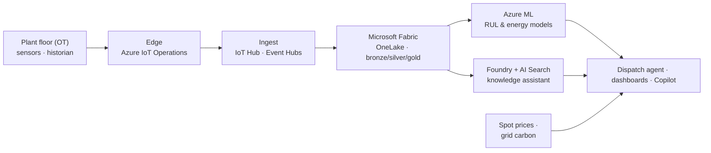

# NovaSteel — AI-Powered Steel Production Optimization Platform

> **Project Ignition** — an Azure AI platform that turns plant-floor telemetry
> into three decisions: **predict** furnace-lining failures, **optimize** energy
> against spot prices and grid carbon, and **capture** retiring operators'
> expertise.
>
> *All figures in this repository are illustrative demo estimates and require a
> detailed Azure assessment before any commercial commitment.*

---

## At a glance

NovaSteel is a Luxembourg-based integrated steel producer operating blast
furnaces and rolling mills across **Luxembourg, Germany, Belgium and Spain**,
supplying flat and long steel to the automotive, construction, energy and
engineering industries. *Project Ignition* is the AI platform proposed to make
that production cheaper, greener, more reliable and more resilient to knowledge
loss.

| | |
| --- | --- |
| **Industry** | Heavy Industry & Metals |
| **Cloud** | Microsoft Azure (EU regions — Sweden Central / West Europe / Germany West Central) |
| **Core stack** | Microsoft Fabric · Azure IoT · Azure Machine Learning · Microsoft Foundry (GPT-5) · Azure Functions / Container Apps |
| **Regulatory context** | GDPR · EU AI Act · sector-specific EU directives |

---

## The problem

Four forces are eroding margin and resilience in NovaSteel's operations:

- **Energy** is **35%** of production cost, dispatched with no real-time optimization.
- **CO₂** is exposed to rising **EU Emissions Trading System (ETS)** penalties.
- **Furnace-lining failures** are unpredictable and cost **~€8M per event**.
- **Quality** of high-grade automotive steel is inconsistent, and **retiring operators** take decades of tacit know-how with them.

## The solution

Three AI workloads on a single governed data platform:

| # | AI workload | What it does | Technique |
| - | ----------- | ------------ | --------- |
| 1 | **Predictive maintenance** | 21-day advance warning of furnace-lining degradation from thermal signatures | Physics-informed ML |
| 2 | **Energy-dispatch optimization** | Schedules energy-intensive processes around electricity spot prices & grid carbon | Optimization agent |
| 3 | **Knowledge capture** | Interviews operators and structures expertise into a searchable procedure library | GenAI + RAG |

## Target outcomes

| Outcome | Target | Why it matters |
| ------- | ------ | -------------- |
| Energy per ton | **−14%** | Directly attacks 35% of cost |
| CO₂ emissions | **−22%** | Avoids EU ETS penalties; sustainability story |
| Furnace failure warning | **21 days** | Avoids ~€8M per averted catastrophic failure |
| High-grade yield | **+8%** | More saleable premium automotive steel |

---

## Architecture

Telemetry flows from the plant floor (OT) through an Arc-enabled edge, into a
Microsoft Fabric medallion data platform, and out to three AI workloads —
all wrapped in Entra ID, Key Vault, Purview, Defender and Azure Monitor.

For the full reference architecture, see
[02 — Solution architecture](docs/usecase/First_Proposal/02-solution-architecture.md)
and [02a — Fabric + IoT architecture](docs/usecase/First_Proposal/02a-fabric-iot-architecture.md).

---

## Repository structure

| Path | Contents |
| ---- | -------- |
| [docs/usecase/](docs/usecase/) | The business case, use case and the full **Project Ignition** proposal |
| [docs/usecase/First_Proposal/](docs/usecase/First_Proposal/) | Numbered deliverables: charter, architecture, AI design, costs, compliance, deck, demo |
| [docs/usecase/website/](docs/usecase/website/) | MkDocs site explaining NovaSteel, steel production and the company |
| [docs/business/](docs/business/) | Business documentation, logos and editable diagrams |
| [docs/technical/](docs/technical/) | Technical documentation |
| [infrastructure/](infrastructure/) | Azure Infrastructure-as-Code (Bicep) for the platform |
| [apps/steel_factory_simulator/](apps/steel_factory_simulator/) | C# / Razor simulator of blast furnaces & rolling mills (synthetic telemetry) |
| [website/](website/) | Public-facing website |

### Proposal deliverables

| # | Document | Answers |
| - | -------- | ------- |
| 00 | [Executive summary](docs/usecase/First_Proposal/00-executive-summary.md) | Why, what, value — on one page |
| 01 | [Project charter](docs/usecase/First_Proposal/01-project-charter.md) | Scope, stakeholders, governance, KPIs |
| 02 | [Solution architecture](docs/usecase/First_Proposal/02-solution-architecture.md) | The Azure reference architecture |
| 02a | [Fabric + IoT architecture](docs/usecase/First_Proposal/02a-fabric-iot-architecture.md) | The Fabric estate & IoT ingestion |
| 03 | [Data & AI design](docs/usecase/First_Proposal/03-data-and-ai-design.md) | The three AI workloads & Responsible AI |
| 04 | [Implementation plan](docs/usecase/First_Proposal/04-implementation-plan.md) | Phased roadmap, team, risks |
| 05 | [Cost estimate & ROI](docs/usecase/First_Proposal/05-cost-estimate.md) | TCO, benefits, ROI/NPV/payback |
| 06 | [Security & compliance](docs/usecase/First_Proposal/06-security-compliance.md) | GDPR, EU AI Act, Responsible AI |
| 07 | [Presentation deck](docs/usecase/First_Proposal/07-presentation-deck.md) | Slide-by-slide narrative |
| 08 | [Demo script](docs/usecase/First_Proposal/08-demo-script.md) | Live walkthrough |

---

## Getting started

1. **Read the pitch** — start with [00 — Executive summary](docs/usecase/First_Proposal/00-executive-summary.md), then walk the [07 — Presentation deck](docs/usecase/First_Proposal/07-presentation-deck.md).
2. **Understand the design** — drill into [02 architecture](docs/usecase/First_Proposal/02-solution-architecture.md), [03 data & AI](docs/usecase/First_Proposal/03-data-and-ai-design.md) and [06 compliance](docs/usecase/First_Proposal/06-security-compliance.md).
3. **Deploy the platform** — provision the Azure estate from [infrastructure/](infrastructure/README.md) (Bicep).
4. **Run the demo** — generate synthetic telemetry with the [steel factory simulator](apps/steel_factory_simulator/README.md) and follow the [08 — Demo script](docs/usecase/First_Proposal/08-demo-script.md).

---

## Compliance & Responsible AI

- **EU data residency** throughout; personal data stays in the EU.
- **EU AI Act** risk assessment per workload; **human-in-the-loop** for any safety, emissions or personnel decision.
- **GDPR / DPIA**, **Microsoft Responsible AI**, and full auditability via Microsoft Purview, Entra ID and Defender for Cloud.

See [06 — Security & compliance](docs/usecase/First_Proposal/06-security-compliance.md).

---

## License

See [LICENSE](LICENSE).

