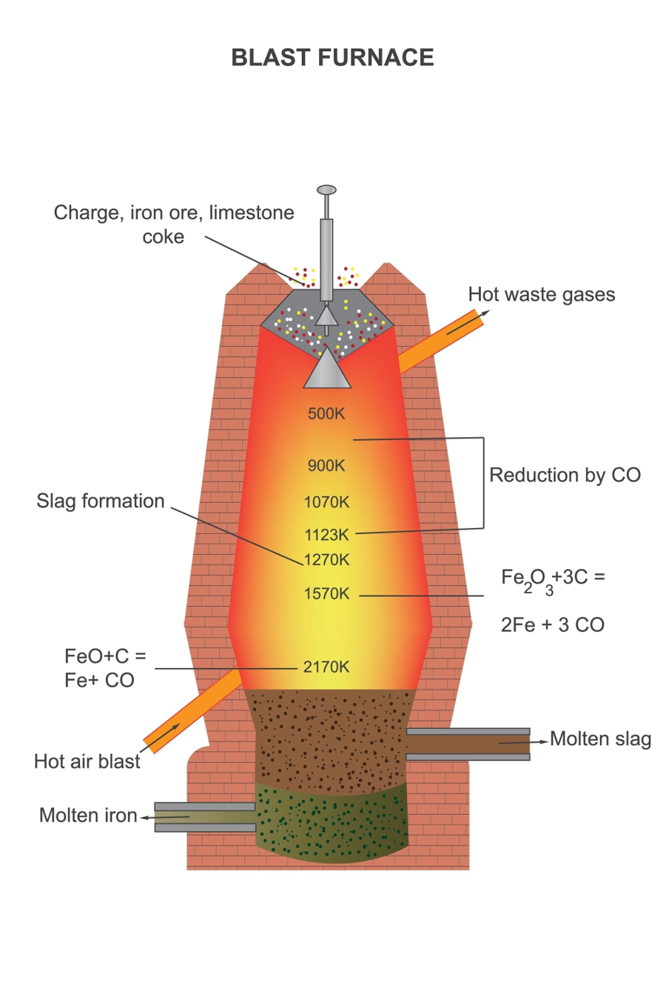
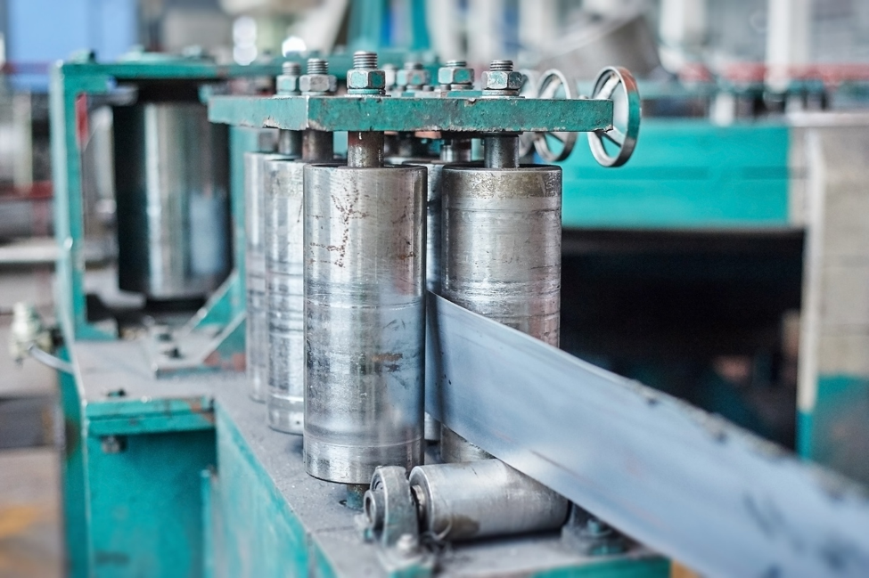

# Production et transformation de l'acier — Guide pour débutants

> **À qui s'adresse ce guide ?** À toute personne qui ne connaît *rien* à
> l'industrie sidérurgique et qui souhaite comprendre, depuis les bases, comment
> l'acier est fabriqué, comment il est transformé en produits utiles, et pourquoi
> cela compte pour **NovaSteel** et sa plateforme d'IA *Project Ignition*.
>
> **Comment le lire.** Commencez par le début et descendez — chaque section
> s'appuie sur la précédente. Si vous n'avez que cinq minutes, lisez plutôt la
> [version simplifiée](steel-production-and-processing-simplified_FR.md).

---

## Table des matières

1. [Pourquoi l'acier est important](#1-pourquoi-lacier-est-important)
2. [Qu'est-ce que l'acier ? Fer, carbone et alliages](#2-quest-ce-que-lacier--fer-carbone-et-alliages)
3. [Les matières premières](#3-les-matières-premières)
4. [Les deux grandes filières de production](#4-les-deux-grandes-filières-de-production)
5. [Étape 1 — Production de fonte : le haut-fourneau](#5-étape-1--production-de-fonte--le-haut-fourneau)
6. [Étape 2 — Aciérie : transformer la fonte en acier](#6-étape-2--aciérie--transformer-la-fonte-en-acier)
7. [Étape 3 — Coulée : du liquide au solide](#7-étape-3--coulée--du-liquide-au-solide)
8. [Étape 4 — Transformation de l'acier : laminage et finition](#8-étape-4--transformation-de-lacier--laminage-et-finition)
9. [Produits et nuances d'acier](#9-produits-et-nuances-dacier)
10. [Énergie, émissions et durabilité](#10-énergie-émissions-et-durabilité)
11. [Qualité, sécurité et rôle des opérateurs](#11-qualité-sécurité-et-rôle-des-opérateurs)
12. [Lien avec NovaSteel et Project Ignition](#12-lien-avec-novasteel-et-project-ignition)
13. [Glossaire](#13-glossaire)

---

## 1. Pourquoi l'acier est important

L'acier est le **métal le plus utilisé sur la planète**. Il est présent dans les
voitures que nous conduisons, les bâtiments et les ponts que nous traversons, les
voies ferrées et les pipelines qui transportent biens et énergie, les machines de
chaque usine et les boîtes de conserve de nos cuisines. Il est solide,
relativement bon marché, **recyclable à l'infini** et peut être ajusté à des
milliers de propriétés différentes en changeant sa recette.

Fabriquer de l'acier est aussi l'une des activités industrielles les plus
**gourmandes en énergie et émettrices de carbone** au monde. L'industrie
sidérurgique mondiale est responsable d'environ **7 à 9 % de toutes les émissions
de CO₂ d'origine humaine**. Ce seul fait explique une grande partie de ce qui
suit : presque toutes les améliorations modernes de la sidérurgie visent à
produire **plus d'acier, de meilleure qualité, avec moins d'énergie et moins de
carbone**.

**NovaSteel** est un producteur sidérurgique *intégré* basé au Luxembourg,
exploitant des hauts-fourneaux et des laminoirs au Luxembourg, en Allemagne, en
Belgique et en Espagne. Il fournit des produits plats et longs aux secteurs de
l'automobile, de la construction, de l'énergie et de l'ingénierie. Comprendre le
fonctionnement d'une telle usine est la clé pour comprendre les problèmes
métiers que *Project Ignition* entend résoudre.

---

## 2. Qu'est-ce que l'acier ? Fer, carbone et alliages

### Fer et acier

Le **fer** est un élément chimique (symbole **Fe**) extrait du sol sous forme de
**minerai de fer** — une roche riche en oxydes de fer (du fer combiné à de
l'oxygène). Le fer pur est relativement mou et rouille facilement ; il est donc
rarement utilisé seul.

L'**acier** est un **alliage** — un mélange volontaire — de **fer et d'une petite
quantité de carbone** (généralement moins de 2 %). Cette pincée de carbone
transforme le fer mou en un matériau bien plus **solide et dur**. Si la teneur en
carbone est mal maîtrisée, le métal devient cassant ; c'est pourquoi le contrôle
de la composition chimique est si important.

| Matériau | Teneur en carbone | Caractère |
| -------- | ----------------- | --------- |
| Fer pur | ~0 % | Mou, se plie facilement |
| Acier | jusqu'à ~2 % | Solide, tenace, polyvalent |
| Fonte | ~2–4 % | Dure mais cassante |

### Éléments d'alliage

Au-delà du carbone, les aciéristes ajoutent de petites quantités d'autres
éléments pour ajuster finement les propriétés :

- **Manganèse** — résistance et ténacité
- **Chrome** — dureté et résistance à la corrosion (élément clé de l'acier
  *inoxydable*)
- **Nickel** — ténacité et résistance à la corrosion
- **Silicium** — utilisé dans les aciers électriques (transformateurs)
- **Molybdène, vanadium, niobium** — résistance à haute température, grain fin

Changer la recette — ainsi que la façon dont l'acier est chauffé et refroidi —
produit des milliers de **nuances** distinctes, chacune conçue pour une tâche
précise. Un acier à haute résistance pour la cellule de sécurité d'une voiture
est une nuance très différente d'un acier d'emboutissage pour un panneau de
portière lisse, bien que les deux soient de « l'acier ».

---

## 3. Les matières premières

La sidérurgie intégrée part de la roche et du charbon. Les principaux intrants
sont :

- **Le minerai de fer** — la source de fer. Souvent livré sous forme de poudre
  fine cuite en agglomérés appelés **aggloméré (sinter)** ou **boulettes
  (pellets)** afin que l'air puisse circuler dans le four.
- **Le coke** — du charbon cuit en l'absence d'air pour en chasser les
  impuretés. Le coke est à la fois le **combustible** qui chauffe le four et
  l'**agent réducteur** chimique qui arrache l'oxygène au minerai de fer.
- **Le calcaire (fondant)** — ajouté pour capturer les impuretés et les faire
  remonter sous forme de déchet vitreux appelé **laitier**.
- **L'air / l'oxygène** — soufflé pour brûler le coke (d'où le nom de
  *haut-fourneau*, qui fonctionne par soufflage).
- **La ferraille d'acier** — de l'acier recyclé, refondu. La ferraille est le
  principal intrant de la filière « électrique » décrite ci-dessous.

> **Idée clé — la réduction.** Le minerai de fer, c'est du fer « collé » à de
> l'oxygène. La chimie centrale de la production de fonte consiste à **retirer
> cet oxygène** (« réduction ») pour ne conserver que le fer métallique. Le coke
> apporte le carbone qui capte l'oxygène et s'échappe sous forme de dioxyde et de
> monoxyde de carbone — ce qui explique précisément pourquoi le procédé émet
> autant de CO₂.

---

## 4. Les deux grandes filières de production

Il existe deux grandes façons de fabriquer de l'acier. NovaSteel est un
producteur **intégré**, c'est-à-dire qu'il utilise la première filière.

### Filière A — Intégrée (Haut-fourneau + Convertisseur à oxygène)

Minerai de fer → **haut-fourneau** → fonte liquide → **convertisseur à oxygène
(BOF)** → acier. C'est la filière classique, à grande échelle, pour fabriquer de
l'acier **à partir du minerai brut**. Elle produit les plus grands volumes et la
qualité la plus élevée et la plus régulière — mais c'est la plus **gourmande en
énergie et en carbone**, car le haut-fourneau brûle d'énormes quantités de coke.

### Filière B — Électrique (Four à arc électrique)

**Ferraille d'acier** (et parfois fer préréduit) → **four à arc électrique
(EAF)** → acier. De puissants arcs électriques font fondre la ferraille recyclée.
Cette filière consomme bien **moins d'énergie et émet bien moins de CO₂ par
tonne**, et son empreinte dépend fortement de la *propreté* de l'électricité. Elle
est plus flexible et plus rapide à démarrer et à arrêter, ce qui compte lorsque
les prix de l'électricité varient d'heure en heure.

| | Intégrée (HF–BOF) | Électrique (EAF) |
| --- | --- | --- |
| Intrant principal | Minerai de fer + coke | Ferraille d'acier |
| Source d'énergie | Coke (charbon) | Électricité |
| CO₂ par tonne | Élevé | Plus faible (selon le réseau) |
| Usage typique | Très grands volumes, nuances premium | Production recyclée / flexible |

La suite de ce guide suit la **Filière A**, la filière intégrée de NovaSteel, du
début à la fin.

---

## 5. Étape 1 — Production de fonte : le haut-fourneau

Le **haut-fourneau** est le cœur en forme de cheminée d'une usine sidérurgique
intégrée. C'est essentiellement un gigantesque réacteur chimique fonctionnant en
continu, qui transforme le minerai de fer solide en **fonte liquide**.

**Fonctionnement, étape par étape :**

1. **Chargement par le haut.** Des couches de minerai de fer (aggloméré /
   boulettes), de coke et de calcaire sont déversées par le sommet, formant une
   haute colonne à l'intérieur du four.
2. **Vent chaud par le bas.** Un souffle d'**air très chaud (~1 200 °C)** — et
   souvent d'oxygène pur — est injecté près de la base.
3. **Combustion et réduction.** Le souffle brûle le coke, atteignant des
   températures supérieures à **2 000 °C**. Les gaz chauds remontent à travers la
   colonne qui descend, et le carbone du coke **arrache l'oxygène du minerai de
   fer**, laissant du fer métallique.
4. **Fusion et collecte.** Le fer fond et coule vers le bas pour s'accumuler au
   fond sous forme de **fonte liquide**. Le calcaire capture les impuretés et
   flotte au-dessus sous forme de **laitier**, périodiquement évacué.
5. **Coulée (tapping).** Toutes les quelques heures, le four est « percé » : la
   fonte liquide est vidée dans d'énormes poches (les **wagons-torpilles**) et
   acheminée, encore en fusion, vers l'étape suivante.

Un haut-fourneau fonctionne **sans interruption pendant des années** entre les
grandes réfections. Son intérieur est protégé par un **revêtement réfractaire** —
des briques et matériaux résistants à la chaleur qui protègent la coque en acier
de la chaleur extrême. **Ce revêtement s'use lentement.** S'il cède de manière
inattendue, la fonte liquide peut percer, provoquant une défaillance
catastrophique et dangereuse pouvant coûter des millions d'euros et arrêter la
production — un problème abordé à la
[Section 12](#12-lien-avec-novasteel-et-project-ignition).

> **La fonte liquide qui sort du haut-fourneau n'est pas encore de l'acier.** Elle
> contient encore trop de carbone et des impuretés indésirables. La transformer
> en acier est l'étape suivante.

---

## 6. Étape 2 — Aciérie : transformer la fonte en acier

La fonte liquide issue du haut-fourneau est « affinée » en acier — c'est-à-dire
que sa composition chimique est **ajustée avec précision** en retirant l'excès de
carbone et les impuretés et en ajoutant des éléments d'alliage.

### Le convertisseur à oxygène (BOF)

Dans le **convertisseur à oxygène**, la fonte liquide (plus un peu de ferraille)
est versée dans une énorme cuve en forme de poire. Une lance souffle de
l'**oxygène pur** à la surface à vitesse supersonique. L'oxygène brûle l'excès de
carbone et les impuretés dans une réaction violente et incandescente d'environ
**20 minutes** seulement. Le résultat est de l'**acier brut** liquide, dont la
teneur en carbone est ramenée dans la bonne plage.

### Le four à arc électrique (EAF) — l'alternative

Dans la filière électrique, un **four à arc électrique** fait fondre la ferraille
à l'aide de gigantesques électrodes qui produisent des arcs plus chauds que la
surface du soleil. Il aboutit au même résultat — de l'acier liquide — par un
chemin différent.

### Métallurgie secondaire (affinage en poche)

L'acier brut issu du BOF ou de l'EAF est rarement prêt tel quel. Il passe à la
**métallurgie secondaire** (aussi appelée *affinage en poche*), où les opérateurs :

- **ajustent finement la composition chimique** en ajoutant des quantités
  précises d'éléments d'alliage ;
- **éliminent les gaz dissous** et les inclusions indésirables pour un acier plus
  propre ;
- **règlent la température** pour que l'acier soit exactement prêt pour la coulée.

C'est ici qu'un lot générique d'acier devient une **nuance spécifique** pour un
client précis — par exemple un acier haut de gamme pour panneaux de carrosserie
automobile. Obtenir cette composition et cette température de façon régulière est
au cœur de la **qualité**, et c'est l'une des choses les plus difficiles à
réussir de façon fiable d'un lot à l'autre.

---

## 7. Étape 3 — Coulée : du liquide au solide

L'acier liquide doit être solidifié en une forme exploitable. La quasi-totalité
de l'acier moderne est solidifiée par **coulée continue**.

Dans la coulée continue, l'acier liquide est versé dans une lingotière refroidie
à l'eau et tiré **en continu** sous forme d'un brin incandescent qui se solidifie.
En avançant, il est refroidi et découpé en longues formes semi-finies :

- **Brames (slabs)** — blocs larges et plats → deviennent des **produits plats**
  (tôle, plaque, bobine).
- **Blooms / billettes** — barres plus carrées et longues → deviennent des
  **produits longs** (poutrelles, barres, rails, fil machine).

Ces pièces semi-finies sont la matière de départ de l'étape de mise en forme qui
suit. Ce sont essentiellement de l'**acier sous une forme pratique et
stockable**, en attente d'être laminé en produits finis.

---

## 8. Étape 4 — Transformation de l'acier : laminage et finition

La « **transformation de l'acier** » regroupe tout ce qui se passe *après* la
coulée — la transformation de ces brames et billettes en formes, épaisseurs et
états de surface précis que les clients achètent réellement. Le cheval de bataille
de la transformation est le **laminoir**.

### Qu'est-ce que le laminage ?

Le **laminage** écrase l'acier, chaud ou froid, entre de lourds cylindres en
rotation, comme une machine à pâtes géante. Chaque passage rend l'acier **plus
mince, plus long et plus plat** (ou lui donne un profil). C'est de loin la façon
la plus importante de mettre l'acier en forme.

### Laminage à chaud

La brame est réchauffée jusqu'à l'incandescence (~1 200 °C) et passée
d'avant en arrière entre de puissants cylindres. À chaud, l'acier est mou et
facile à former, de grandes réductions d'épaisseur sont donc possibles. Une
brame épaisse peut devenir une longue et fine **bobine laminée à chaud** en
quelques minutes. Le laminage à chaud sert aux plaques, poutrelles, rails et aux
bobines de départ pour la suite de la transformation.

### Laminage à froid

Pour obtenir des épaisseurs plus fines, une surface plus lisse et des tolérances
plus serrées, la bobine laminée à chaud est laminée à nouveau **à température
ambiante**. Le laminage à froid rend l'acier **plus dur et plus résistant** et
donne l'excellent état de surface nécessaire, par exemple, aux panneaux de
carrosserie visibles ou aux appareils électroménagers.

### Opérations de finition

Après le laminage, l'acier est souvent fini pour ajouter des propriétés et une
protection :

- **Recuit** — chauffage et refroidissement contrôlés pour adoucir l'acier et
  relâcher les contraintes introduites par le laminage à froid, restaurant
  l'aptitude à la mise en forme.
- **Décapage** — un bain d'acide qui élimine la calamine (oxyde) de la surface.
- **Revêtement** — application d'une couche protectrice :
  - **Galvanisation** — un revêtement de zinc qui prévient la rouille (courant
    sur les carrosseries).
  - **Étamage** — pour les boîtes de conserve.
  - **Peinture / revêtements organiques** — couleur et protection contre les
    intempéries.
- **Découpe, refendage et mise en forme** — découpe des bobines et plaques aux
  largeurs, longueurs et formes exactes commandées par le client.

Le résultat de la transformation est de l'**acier fini** : bobines, tôles,
plaques, poutrelles, barres et fil machine, chacun fabriqué selon une
spécification stricte.

---

## 9. Produits et nuances d'acier

Les produits sidérurgiques se répartissent généralement en deux grandes familles :

- **Produits plats** — issus des brames : plaque, tôle, feuillard et bobine.
  Utilisés pour les carrosseries, l'électroménager, les tubes, les boîtes et
  l'emballage.
- **Produits longs** — issus des blooms / billettes : poutrelles, poteaux,
  barres, rails, fil machine. Utilisés pour la construction, les chemins de fer et
  l'armature du béton.

Une **nuance** est une spécification précise — une composition chimique définie
plus un historique de transformation défini — qui garantit des propriétés
particulières (résistance, ductilité, résistance à la corrosion, aptitude à la
mise en forme). Par exemple, un **acier automobile haut de gamme** doit être à la
fois résistant et suffisamment formable pour être embouti en formes complexes
sans se fissurer, avec une surface impeccable et une **très grande régularité
d'une bobine à l'autre**. Les clients comme les constructeurs automobiles
rejettent les matériaux qui s'écartent de la spécification ; la **régularité** est
donc aussi précieuse que l'acier lui-même.

---

## 10. Énergie, émissions et durabilité

La sidérurgie est **avide d'énergie** et constitue une **source majeure de CO₂** :

- Le **haut-fourneau** brûle d'énormes quantités de coke, et ce carbone s'échappe
  sous forme de **CO₂**. C'est la principale raison pour laquelle l'acier
  représente une part importante des émissions mondiales.
- Le **réchauffage, le laminage et la finition** consomment tous de grandes
  quantités de chaleur et d'électricité. Chez NovaSteel, l'**énergie représente
  environ 35 % du coût total de production**.

Deux grandes pressions externes façonnent l'économie du secteur :

- **Le système d'échange de quotas d'émission de l'UE (SEQE-UE).** Les producteurs
  doivent détenir des « quotas » pour le CO₂ qu'ils émettent. À mesure que les
  quotas se raréfient et renchérissent, **chaque tonne de CO₂ a un coût financier
  direct** — réduire les émissions réduit donc les coûts et les pénalités.
- **La volatilité des prix de l'électricité.** Les prix de l'énergie varient
  d'heure en heure. Faire tourner les étapes énergivores quand l'électricité est
  **bon marché et propre** — et lever le pied quand elle est **chère et carbonée**
  — peut faire économiser beaucoup d'argent et de carbone.

C'est pourquoi l'**optimisation énergétique** et la **réduction des émissions** ne
sont pas seulement des objectifs environnementaux mais bien des objectifs
**métiers** essentiels.

---

## 11. Qualité, sécurité et rôle des opérateurs

Les usines sidérurgiques fonctionnent **en continu**, à des températures
extrêmes, avec du métal en fusion et des machines lourdes. Deux facteurs humains
dominent la réussite au quotidien :

- **Le contrôle qualité.** Chaque nuance a des tolérances strictes. De minuscules
  écarts de composition, de température ou de laminage peuvent faire sortir tout
  un lot de la spécification, l'obligeant à être mis au rebut ou déclassé. La
  régularité est primordiale, surtout pour des clients exigeants comme les
  constructeurs automobiles.
- **L'expertise des opérateurs.** Une grande partie du savoir-faire qui maintient
  une usine en marche de façon sûre et efficace réside dans la tête des
  **opérateurs expérimentés** — comment un four « sonne » quand quelque chose ne
  va pas, comment réagir à une lecture inhabituelle, quel petit réglage évite un
  gros problème. Une grande partie de ce savoir est **tacite** : jamais consigné
  par écrit.

À mesure que les opérateurs qualifiés **partent à la retraite**, des décennies de
jugement durement acquis peuvent quitter l'entreprise plus vite qu'elles ne
peuvent être transmises aux nouveaux venus. **Capturer et structurer ce savoir**
avant qu'il ne soit perdu est une priorité stratégique — et une tâche parfaite
pour l'IA moderne.

---

## 12. Lien avec NovaSteel et Project Ignition

Tout ce qui précède explique les défis métiers à l'origine du
*[Project Ignition](../usecase/usecase_FR.md)* de NovaSteel. Les points de
douleur de l'usine correspondent directement aux bases de la sidérurgie de ce
guide :

| Réalité sidérurgique (ce guide) | Défi NovaSteel | Réponse IA *Project Ignition* |
| --- | --- | --- |
| Le **revêtement réfractaire** du haut-fourneau s'use et peut céder de façon catastrophique ([§5](#5-étape-1--production-de-fonte--le-haut-fourneau)) | Les défaillances de revêtement sont imprévisibles et coûtent **~8 M€ par événement** | Un **modèle d'apprentissage automatique informé par la physique** prédit la dégradation du revêtement à partir des signatures thermiques — *préavis de 21 jours* |
| La sidérurgie est **énergivore** et exposée aux prix spot et au SEQE-UE ([§10](#10-énergie-émissions-et-durabilité)) | L'énergie représente **35 % du coût** ; le CO₂ subit les pénalités du SEQE | Un **agent d'optimisation de la répartition énergétique** planifie les étapes énergivores selon les prix de l'électricité et le carbone du réseau |
| La **qualité** des aciers haut de gamme doit être très régulière ([§9](#9-produits-et-nuances-dacier), [§11](#11-qualité-sécurité-et-rôle-des-opérateurs)) | La qualité est irrégulière pour les clients automobiles | Une optimisation pilotée par les données pour améliorer le **rendement haut de gamme** |
| Le **savoir-faire des opérateurs est tacite** et part à la retraite ([§11](#11-qualité-sécurité-et-rôle-des-opérateurs)) | La connaissance disparaît plus vite qu'elle n'est capturée | Un **assistant IA générative de capture de connaissances** interroge les opérateurs et construit une bibliothèque de procédures interrogeable |

En bref : une fois que l'on comprend *comment* l'acier est fabriqué et *pourquoi*
il est si gourmand en énergie, en carbone et en savoir, la justification d'une
plateforme d'optimisation par l'IA comme Project Ignition devient évidente.

---

## 13. Glossaire

| Terme | Signification en langage simple |
| ----- | ------------------------------- |
| **Alliage** | Métal obtenu en mélangeant un métal de base avec d'autres éléments pour améliorer ses propriétés. |
| **Recuit** | Chauffage puis refroidissement lent de l'acier pour l'adoucir et relâcher les contraintes internes. |
| **Convertisseur à oxygène (BOF)** | Cuve qui souffle de l'oxygène dans la fonte liquide pour brûler le carbone et faire de l'acier. |
| **Billette / Bloom** | Demi-produit d'acier long et plutôt carré, laminé en produits longs. |
| **Haut-fourneau** | Réacteur géant qui transforme le minerai de fer en fonte liquide grâce au coke et à l'air chaud. |
| **Coke** | Charbon cuit sans air ; combustible et agent réducteur du haut-fourneau. |
| **Coulée continue** | Solidification de l'acier liquide en un brin continu, ensuite découpé en brames / billettes. |
| **EAF (four à arc électrique)** | Four qui fait fondre la ferraille d'acier au moyen d'arcs électriques. |
| **SEQE-UE** | Système d'échange de quotas d'émission de l'UE — un marché qui met un prix sur l'émission de CO₂. |
| **Produits plats** | Tôle, plaque, feuillard et bobine issus des brames. |
| **Fondant (calcaire)** | Matériau ajouté pour capturer les impuretés sous forme de laitier. |
| **Nuance** | Spécification précise d'un acier (composition + transformation) garantissant des propriétés définies. |
| **Laminage à chaud / à froid** | Écrasement de l'acier entre cylindres pour le former — à chaud (mou) ou à froid (précis, résistant). |
| **Minerai de fer** | Roche riche en oxydes de fer ; source brute du fer. |
| **Produits longs** | Poutrelles, barres, rails et fil machine issus des blooms / billettes. |
| **Fonte liquide** | Fer liquide coulé du haut-fourneau ; pas encore de l'acier. |
| **Décapage** | Bain d'acide qui nettoie la calamine de la surface de l'acier. |
| **Revêtement réfractaire** | Brique résistante à la chaleur qui protège la coque en acier d'un four de la chaleur extrême. |
| **Métallurgie secondaire** | Affinage en poche qui ajuste finement composition et température avant la coulée. |
| **Brame (slab)** | Demi-produit d'acier large et plat, laminé en produits plats. |
| **Laitier** | Déchet vitreux qui flotte sur le métal en fusion et emporte les impuretés. |
| **Acier** | Alliage de fer avec une petite quantité contrôlée de carbone. |

---

*Voir aussi : la [version simplifiée d'une page](steel-production-and-processing-simplified_FR.md)
et le [cas d'usage](../usecase/usecase_FR.md) de NovaSteel.*
