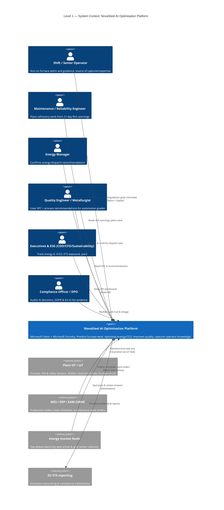
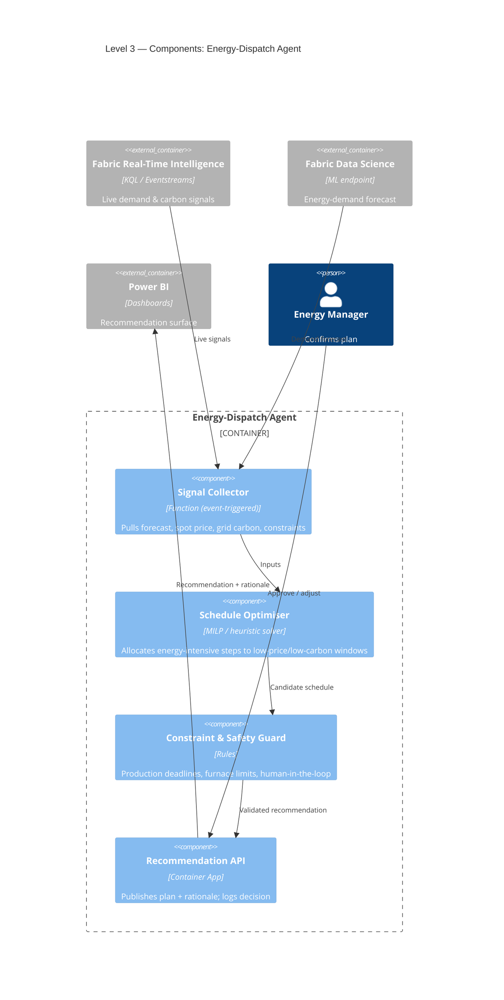
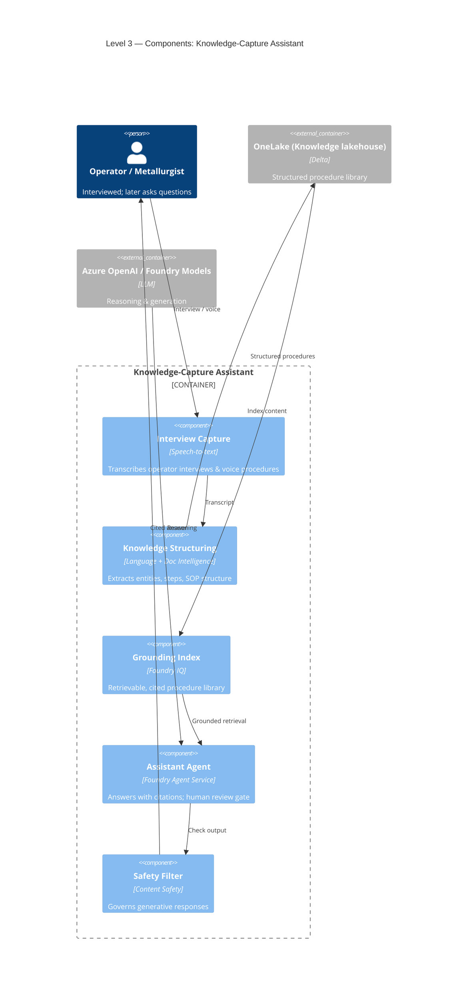
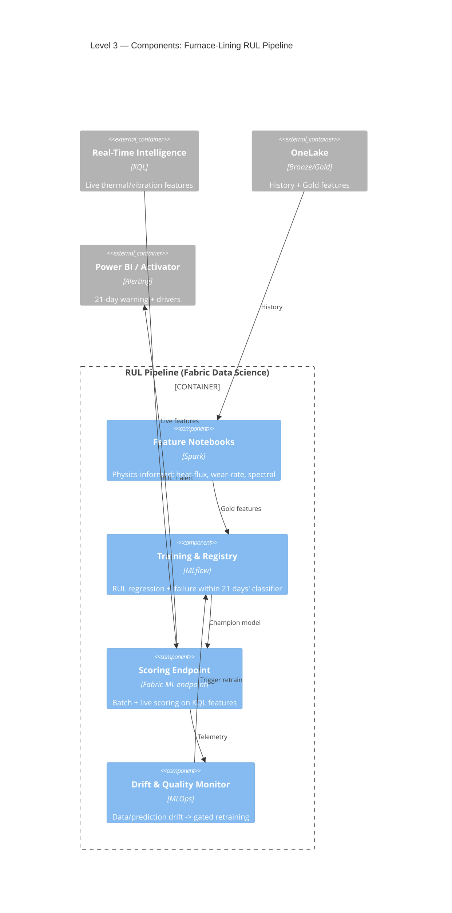
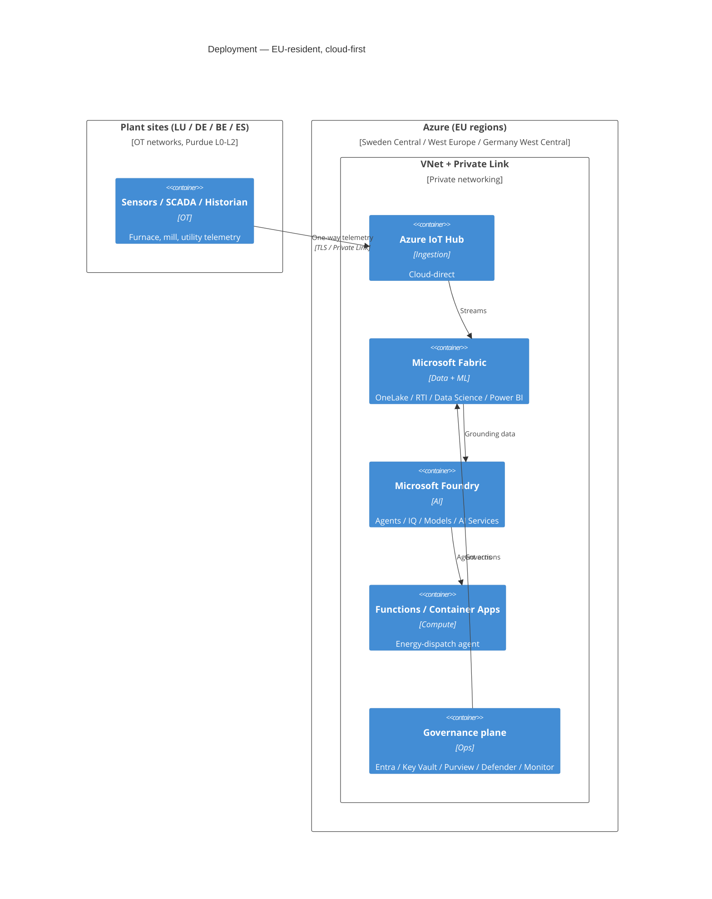

# 🧱 C4 Model — NovaSteel AI-Powered Steel Production Optimisation Platform

The [C4 model](https://c4model.com/) describes the architecture at four zoom
levels — **Context → Containers → Components → Code**. This document applies it to
the NovaSteel platform, grounded in three companion analyses:

- **Use case:** [docs/usecase/usecase.md](../usecase.md) — challenges, KPIs, AI workloads.
- **Service scope:** [1_Azure_Services.md](1_Azure_Services.md) — the **Fabric + Foundry** scoped set (cloud-direct IoT Hub, no edge runtime).
- **Solution structure:** [2_mckensey_analysis.md](2_mckensey_analysis.md) — objectives, architecture and value.

> **Scope guardrail.** Only services in the **Final Decision** of
> [1_Azure_Services.md](1_Azure_Services.md) appear here: **Microsoft Fabric**,
> **Microsoft Foundry**, **Azure IoT Hub + Event Hubs** (cloud-direct), **Azure
> Functions / Container Apps**, and the **Entra / Key Vault / Policy / Purview /
> Defender / Monitor** governance plane. Excluded services (Azure ML, Databricks,
> IoT Edge/Operations, Arc, AKS…) are intentionally absent.

---

## 🎯 What the platform must achieve

| Objective | KPI target | Primary AI workload |
| --- | --- | --- |
| ⚡ Reduce energy per ton | **−14%** | Energy-dispatch optimisation agent |
| 🌍 Reduce CO₂ emissions | **−22%** | Energy-dispatch agent (carbon-aware scheduling) |
| 🔥 Predict furnace-lining failure | **21-day** warning | Physics-informed RUL model |
| ✅ Improve high-grade yield | **+8%** | Quality recommendations + SPC |
| 🧑‍🏭 Preserve operator expertise | adoption / coverage | GenAI knowledge-capture assistant |

---

## 1️⃣ Level 1 — System Context

How NovaSteel people and external systems interact with the platform.



### Key relationships

- **Telemetry is one-way out** of the plant (OT/IT safety boundary, Purdue model) and lands **cloud-direct via Azure IoT Hub** — no plant-side edge runtime.
- **Humans stay in the loop**: the platform *recommends*; operators, energy and maintenance teams *confirm* before action.
- **Compliance is first-class**: every prediction, recommendation and approval is traceable for **GDPR** and the **EU AI Act**.

---

## 2️⃣ Level 2 — Containers

The major deployable/managed building blocks and how data flows between them.
Each container maps to an in-scope service from [1_Azure_Services.md](1_Azure_Services.md).

```mermaid
C4Container
    title Level 2 — Containers: NovaSteel AI Optimisation Platform

    Person(operator, "Operators & Engineers", "Plant & central users")
    System_Ext(ot, "Plant OT / IoT", "Sensors, SCADA, historian")
    System_Ext(mes, "MES / ERP / EAM", "Business systems")
    System_Ext(market, "Energy market feeds", "Spot price & grid carbon")

    System_Boundary(platform, "NovaSteel AI Optimisation Platform") {
        Container(iothub, "Azure IoT Hub", "Managed IoT gateway", "Cloud-direct, per-device secure telemetry ingestion")
        Container(eventhubs, "Azure Event Hubs", "Streaming broker", "High-throughput sensor & market streams")

        Container_Boundary(fabric, "Microsoft Fabric (EU capacity)") {
            Container(rti, "Real-Time Intelligence", "Eventstreams / KQL / Activator", "Hot path: sub-second furnace alerts")
            Container(onelake, "OneLake (medallion)", "Lakehouse Bronze/Silver/Gold", "One governed copy of plant + ERP + market data")
            Container(deng, "Data Engineering", "Data Factory / Spark", "Ingestion + physics-informed features")
            Container(dsci, "Data Science (ML in Fabric)", "MLflow / model endpoints", "RUL & energy-forecast models + MLOps")
            Container(pbi, "Power BI", "Direct Lake dashboards", "Exec / engineering / ops views")
        }

        Container_Boundary(foundry, "Microsoft Foundry") {
            Container(agentsvc, "Foundry Agent Service", "Agents", "Knowledge & maintenance copilots")
            Container(fiq, "Foundry IQ", "Grounding / RAG", "Retrieval over the procedure library")
            Container(models, "Azure OpenAI / Foundry Models", "LLMs", "Reasoning, summarisation, extraction")
            Container(aisvc, "AI Services", "Speech / Language / Doc Intelligence / Content Safety", "Operator interview capture & structuring")
        }

        Container(dispatch, "Energy-Dispatch Agent", "Azure Functions / Container Apps", "MILP/heuristic scheduling around spot price & carbon")
        Container(assistant, "Knowledge Assistant Experience", "Teams + Copilot", "Operator Q&A grounded in procedures")

        Container_Boundary(gov, "Governance & Ops plane") {
            Container(entra, "Entra ID + Key Vault", "Identity & secrets", "SSO, conditional access, BYOK")
            Container(purview, "Purview + Azure Policy", "Governance", "Lineage, classification, residency guardrails")
            Container(monitor, "Azure Monitor / App Insights", "Observability", "Logs, traces, drift & SLO alerts")
        }
    }

    Rel(ot, iothub, "Telemetry (one-way out)")
    Rel(iothub, eventhubs, "Device events")
    Rel(iothub, rti, "Stream to hot path")
    Rel(market, eventhubs, "Spot price / carbon")
    Rel(eventhubs, rti, "Ingest streams")
    Rel(mes, deng, "Batch orders / schedules")

    Rel(rti, onelake, "Land Bronze + live KQL")
    Rel(deng, onelake, "Bronze -> Silver -> Gold")
    Rel(onelake, dsci, "Gold features")
    Rel(rti, dsci, "Live features for scoring")
    Rel(dsci, dispatch, "Energy forecast")
    Rel(dsci, pbi, "Predictions & SPC")

    Rel(onelake, fiq, "Procedure library")
    Rel(fiq, models, "Grounded context")
    Rel(aisvc, onelake, "Structured interview content")
    Rel(agentsvc, fiq, "Retrieve & ground")
    Rel(models, assistant, "Cited answers")
    Rel(agentsvc, assistant, "Serve operators")

    Rel(dispatch, pbi, "Recommendations")
    Rel(operator, assistant, "Ask & confirm")
    Rel(operator, pbi, "Monitor KPIs")

    Rel(entra, foundry, "Secures")
    Rel(purview, fabric, "Governs lineage")
    Rel(monitor, dispatch, "Monitors & alerts")
```

### Container responsibilities

| Container | Service | Responsibility |
| --- | --- | --- |
| Ingestion | **Azure IoT Hub** | Secure, per-device, cloud-direct telemetry front door |
| Streaming | **Azure Event Hubs** | High-throughput sensor + external market streams |
| Hot path | **Fabric Real-Time Intelligence** | Sub-second furnace alerting (Eventstreams/KQL/Activator) |
| Data platform | **Fabric OneLake + Data Engineering** | Medallion lake; physics-informed Gold features |
| ML | **Fabric Data Science** | RUL + energy-forecast models, MLflow registry, endpoints, drift monitoring |
| BI | **Power BI (Direct Lake)** | Executive / engineering / operations dashboards |
| AI agents | **Foundry Agent Service + IQ** | Grounded knowledge & maintenance copilots |
| Models | **Azure OpenAI / Foundry Models** | Reasoning, summarisation, extraction |
| AI Services | **Speech / Language / Doc Intelligence / Content Safety** | Operator-interview capture & structuring |
| Optimisation | **Azure Functions / Container Apps** | Energy-dispatch agent (MILP/heuristic) |
| Experience | **Teams + Copilot** | Operator-facing assistant |
| Governance | **Entra · Key Vault · Policy · Purview · Defender · Monitor** | Identity, secrets, residency, lineage, posture, observability |

---

## 3️⃣ Level 3 — Components

### 3a. Energy-Dispatch Agent (Azure Functions / Container Apps)



### 3b. GenAI Knowledge-Capture Assistant (Microsoft Foundry)



### 3c. Furnace-RUL pipeline (Fabric Data Science)



---

## 4️⃣ Level 4 — Code

Code-level detail is intentionally **out of scope** for this architecture document.
At delivery time it is expressed as repository artefacts rather than diagrams:

- **Infrastructure as Code** — Bicep/Terraform for the scoped services (see `infrastructure/`).
- **Fabric notebooks & pipelines** — physics-informed feature engineering and model training.
- **Agent code** — energy-dispatch solver (Functions/Container Apps) and Foundry agent definitions.
- **CI/CD** — GitHub Actions for apps, ML promotion and IaC.

---

## 🚀 Deployment view (EU-resident)



- **Data residency**: Fabric capacity and Foundry pinned to **EU regions**; private access via **VNet + Private Link**.
- **Phased rollout** (per [2_mckensey_analysis.md](2_mckensey_analysis.md) §9): pilot one furnace → multi-line → four-country scale-out.

---

## 🔐 Cross-cutting concerns

| Concern | How it is addressed |
| --- | --- |
| 🪪 Identity & access | Microsoft Entra ID (SSO, conditional access); least-privilege by domain |
| 🔑 Secrets | Azure Key Vault (BYOK / customer-managed keys) |
| 🛡️ Security posture | Microsoft Defender for Cloud; OT one-way egress; private endpoints |
| 📜 Governance & residency | Azure Policy guardrails; EU-region pinning |
| 🧬 Lineage & compliance | Microsoft Purview (sensor → feature → model → report); EU AI Act dossier |
| 📈 Observability | Azure Monitor / Application Insights — logs, traces, model-drift, SLO alerts |
| 🧑‍⚖️ Responsible AI | Human-in-the-loop on every action; uncertainty shown; RAG citations; Content Safety |

---

## 🧭 Traceability — objectives → containers

| Objective (KPI) | Containers involved |
| --- | --- |
| ⚡ −14% energy | IoT Hub → Event Hubs → Fabric RTI + Data Science → Energy-Dispatch Agent → Power BI |
| 🌍 −22% CO₂ | Energy-Dispatch Agent (carbon-aware) + Fabric + Purview (auditable emissions) |
| 🔥 21-day furnace warning | IoT Hub → Fabric RTI + Data Science (RUL) → Activator/Power BI |
| ✅ +8% yield | Fabric Gold features + Data Science + Power BI (SPC) |
| 🧑‍🏭 Knowledge capture | AI Services + Foundry IQ + Agent Service + Teams/Copilot |
| 🔐 Governance / EU rules | Entra · Key Vault · Policy · Purview · Defender · Monitor |

