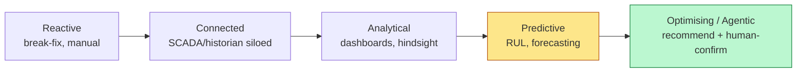

# 1. 🏭 Industry Context & Strategic Drivers

*Audience: Strategy Director (20), COO (1), Head of Sustainability / ESG (11),
Head of Energy Management (7), CDO (12).*

This section frames the external forces that make *Project Ignition* a strategic
imperative rather than a discretionary IT project. The thesis: **European
integrated steelmaking is being squeezed simultaneously on energy, carbon, quality
and workforce — and digital maturity is the differentiator that decides who keeps
margin.**

---

## 1.1 Overview of the European steel industry

European steelmaking is a **capital-intensive, energy-intensive, continuous-process**
industry operating on thin and volatile margins. Integrated producers like
NovaSteel run **blast furnaces (BF), basic-oxygen furnaces (BOF) and
electric-arc furnaces (EAF)** feeding rolling mills, with output sold into
construction, packaging, energy and — most demanding of all — **automotive**.

Structural characteristics that shape the AI opportunity:

- **Asset criticality:** a furnace is a multi-hundred-million-euro asset whose
  unplanned outage cascades across the whole production chain.
- **Process inertia:** decisions (tap temperature, charge chemistry, dispatch
  timing) must be made continuously and cannot easily be "paused".
- **Heterogeneous data estate:** decades of **SCADA, PLC and historian** data exist
  but are siloed by site, vendor and vintage.
- **Tacit expertise:** much know-how lives in the heads of senior operators, not in
  systems.

NovaSteel's **four-country footprint** (LU, DE, BE, ES) multiplies this complexity:
different grids, energy contracts, regulators and operating cultures, with a need
for **one repeatable operating model** rather than four bespoke ones.

## 1.2 Energy volatility and cost pressure

Energy is the single largest controllable cost in NovaSteel's structure:

- Energy is **~35% of total production cost** (illustratively ~**€175/t** on a
  ~€500/t cost base).
- European power prices are **volatile and increasingly time-variable**, driven by
  the growing share of intermittent renewables and the day-ahead spot market.
- NovaSteel currently dispatches energy-intensive steps with **no real-time
  optimisation** — it pays the average, not the optimum.

**Strategic implication:** even a modest, reliable shift of flexible load toward
**low-price / low-carbon windows** attacks the largest cost line. A **−14%** energy
reduction on a 1.0 Mt site is worth **~€24.5M/yr** illustratively — the dominant
value lever in the entire programme.

## 1.3 EU ETS and carbon pricing impact

The **EU Emissions Trading System (ETS)** puts a direct, rising price on every
tonne of CO₂. Combined with the phase-down of free allowances and the arrival of
the **Carbon Border Adjustment Mechanism (CBAM)**, carbon is becoming a
**first-order P&L item**, not a reporting footnote.

- Illustrative carbon price assumption: **~€70/tCO₂**.
- A **−22%** CO₂ reduction therefore both **avoids ETS penalty cost** and
  strengthens the **ESG / sustainability narrative** with customers and investors.
- Critically, emissions optimisation must **never compromise the integrity of
  emissions reporting** — the platform treats ETS reporting data as **read-only**
  to the AI (see [Section 8](08-security-risk-compliance.md)).

## 1.4 Competitive landscape

NovaSteel competes against **global integrated majors** and **regional
specialists**, several of whom are investing heavily in **digital twins, predictive
maintenance and AI-driven process control**. The competitive dynamics:

| Dimension | Pressure | NovaSteel response via Project Ignition |
|-----------|----------|------------------------------------------|
| **Cost** | Low-cost global supply | Structurally lower energy €/t |
| **Carbon** | Green-steel positioning, CBAM | Verifiable −22% CO₂ story |
| **Quality** | Automotive OEM qualification | +8% high-grade yield, full traceability |
| **Reliability** | Outage-driven cost swings | 21-day failure warning |
| **Talent** | Ageing workforce industry-wide | Knowledge capture as durable moat |

Digital maturity is becoming **the** axis of differentiation: the producers who turn
plant data into decisions fastest will out-earn those who don't.

## 1.5 Digital transformation maturity in heavy industry

Heavy industry has historically lagged in cloud and AI adoption for valid reasons —
**OT/IT safety boundaries**, legacy historians, and a (correct) conservatism about
anything that could touch a live furnace. The maturity curve:

NovaSteel today sits around **Connected → Analytical**. *Project Ignition* moves it
to **Predictive and Optimising/Agentic** — **without** crossing the OT safety line:
telemetry flows **one-way out** of the plant, and the platform **recommends** while
humans **decide**. This is the strategically defensible position: the upside of AI
optimisation with the safety posture heavy industry requires.

> **Strategic driver summary.** Energy cost, carbon price, quality demands and an
> ageing workforce are converging. The decisive variable is the speed at which
> NovaSteel can convert its existing plant data into trustworthy decisions. That is
> precisely what *Project Ignition* industrialises.

---

*Continue to → [2. Business Problem Definition](02-business-problem.md)*
