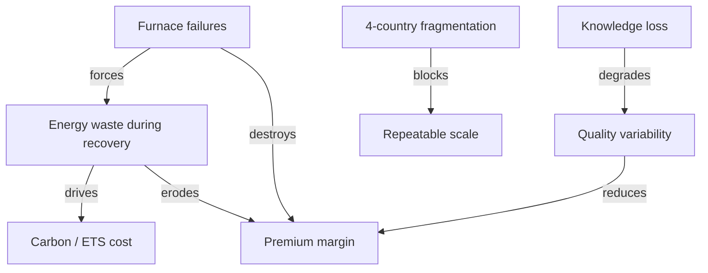

# 2. 🚨 Business Problem Definition

*Audience: COO (1), Plant Director / Site Manager (3), Head of Maintenance (5),
Head of Quality (6), Head of Energy Management (7), Head of HR / Workforce (16).*

This section defines the problem space precisely and **MECE** (mutually exclusive,
collectively exhaustive), so that each AI workload in
[Section 4](04-solution-overview.md) maps to a named, quantified pain.

---

## Problem-to-value at a glance

| # | Problem | Quantified pain | Root cause | Addressed by |
|---|---------|-----------------|------------|--------------|
| P1 | Energy inefficiency | ~35% of cost, no real-time optimisation | Dispatch ignores price/carbon signals | Energy-dispatch agent (O1/O2) |
| P2 | Furnace-lining failures | **~€8M** per event, unpredictable | Wear invisible until catastrophic | Physics-informed RUL (O3) |
| P3 | Quality variability | Lost premium yield, OEM risk | Process variation not controlled | SPC + quality recommendations (O4) |
| P4 | Knowledge loss | Decades of expertise retiring | Tacit know-how never captured | GenAI knowledge capture (O5) |
| P5 | 4-country fragmentation | No repeatable operating model | Siloed sites, data and tooling | Single Fabric/Foundry platform |

---

## 2.1 Energy inefficiency

**Symptom.** Energy is **~35% of total production cost** and is dispatched with
**no real-time optimisation**. Energy-intensive steps run when production demands,
not when electricity is cheapest or cleanest.

**Root cause.** There is no system that continuously (a) forecasts process energy
demand, (b) ingests **day-ahead spot prices** and **grid-carbon intensity**, and
(c) recommends *when* to run flexible load within production deadlines.

**Consequence.** NovaSteel systematically pays **average** energy cost and carbon
intensity rather than the **achievable optimum** — a recurring, compounding loss on
its single largest controllable cost line.

## 2.2 Unpredictable furnace-lining wear

**Symptom.** Refractory lining degrades through thermal and chemical attack, but
wear is **invisible** from the outside. Failures are **catastrophic and
unpredictable**, costing **~€8M per event** (lost production, emergency repair,
collateral damage, safety exposure).

**Root cause.** Thermal signatures, vibration, off-gas chemistry and campaign
history **exist** in the historian but are not fused into a **remaining-useful-life
(RUL)** prediction with a usable lead time.

**Consequence.** Maintenance is **reactive or calendar-based**, not condition-based.
A reliable **21-day warning** would convert an €8M emergency into a **planned,
scheduled refractory intervention**.

## 2.3 Quality variability in high-grade steel

**Symptom.** High-grade steel for **automotive** customers shows **inconsistent
quality**, depressing usable **high-grade yield** and risking OEM qualification
(**IATF 16949**, **EN 10204 3.1** certificates).

**Root cause.** Process parameters (tap temperature, chemistry, cooling/rolling) are
not systematically tied to **outcome variability**; there is no live **statistical
process control (SPC)** loop surfacing which settings reduce variation.

**Consequence.** Out-of-spec heats are downgraded or scrapped, eroding margin on the
**most valuable** product mix. The opportunity is **+8% high-grade yield** by
**reducing variability** (Cp/Cpk), not by shifting the mean — and **without**
removing the metallurgist from the decision.

## 2.4 Knowledge loss as operators retire

**Symptom.** Senior operators and metallurgists — who hold decades of **tacit
process intuition** — are **retiring faster than their expertise is being
captured**.

**Root cause.** Know-how lives in people, shift logs and undocumented practice, not
in a structured, searchable, governed library.

**Consequence.** Each retirement is a permanent capability loss that degrades
quality consistency and slows incident response. A **GenAI knowledge-capture
assistant** converts interviews and SOPs into a **cited procedure library**,
spreading best-known methods to every shift — directly reinforcing the **+8% yield**
objective.

## 2.5 Operational constraints across a 4-country footprint

**Symptom.** NovaSteel runs plants in **Luxembourg, Germany, Belgium and Spain**,
each with its own grid, energy contracts, regulators, languages and operating
culture.

**Root cause.** Without a common data and AI platform, every improvement risks
becoming a **bespoke, non-repeatable** site project.

**Consequence.** Transformation that cannot **scale repeatably** will stall after
the first site. The remedy is a **single governed platform** (one OneLake copy, one
Foundry AI plane, one governance fabric) with **EU data residency** and per-site
configuration — proving the model on one line, then **replicating** it.

---

## Why these problems must be solved together

The five problems are **interdependent**, which is why a point solution
under-delivers:

A **single platform** that shares one data foundation, one governance plane and one
operating model lets each workload reinforce the others — and turns five chronic
problems into one coordinated transformation.

---

*Continue to → [3. Transformation Objectives](03-transformation-objectives.md)*
