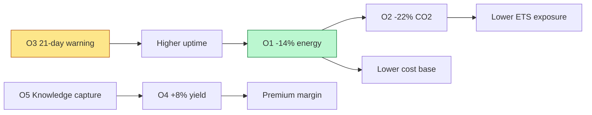

# 3. 🎯 Transformation Objectives

*Audience: COO (1), CFO (19), Head of Sustainability / ESG (11), Head of
Maintenance (5), Head of Quality (6), Head of Energy Management (7).*

The programme is governed by **five objectives (O1–O5)**, each with a named KPI, an
illustrative target, and a baseline owner. These objectives are the contract between
the business and the platform: they define what "success" means and how it is proven
at the pilot gate.

---

## 3.0 Objective scorecard

| # | Objective | KPI | Target | Baseline owner | AI workload |
|---|-----------|-----|--------|----------------|-------------|
| **O1** | Cut energy intensity | Energy per ton (kWh/t, €/t) | **−14%** | COO / Energy | Energy-dispatch agent |
| **O2** | Cut emissions | CO₂ per ton (tCO₂/t) | **−22%** | Head of Sustainability / ESG | Energy-dispatch (carbon-aware) |
| **O3** | Prevent furnace failures | Lead time of lining-failure alert | **≥ 21 days** | COO / Maintenance | Physics-informed RUL |
| **O4** | Improve quality | High-grade yield; Cp/Cpk | **+8% yield** | Head of Quality | SPC + recommendations |
| **O5** | Capture knowledge | Procedures captured; assistant adoption | Library live & adopted | COO / HR | GenAI knowledge capture |

> **Definition of success.** The pilot demonstrates **O1, O3 and O4 on real data**
> within target, with **O2 modelled** against a documented baseline, and a
> **compliant path to scale**.

---

## 3.1 Reduce energy consumption per ton by 14% (O1)

**What.** Lower energy intensity by **−14%** by scheduling flexible, energy-intensive
steps around **day-ahead spot prices** while respecting production deadlines.

**How proven.** **A/B against the historical baseline** — €/ton and kWh/ton with and
without optimisation; **% of production shifted** into low-price windows.

**Why it dominates.** Because energy is **~35%** of a large cost base, O1 is the
single biggest value lever (**~€24.5M/yr** illustrative at a 1.0 Mt site). It is the
financial anchor of the business case.

## 3.2 Reduce CO₂ emissions by 22% (O2)

**What.** Cut CO₂ per ton by **−22%** by also scheduling against **grid-carbon
intensity**, so flexible load runs in **lower-carbon** windows.

**How proven.** **tCO₂/ton vs. baseline**, plus the carbon-aware scheduling share.
Modelled at pilot, measured at scale.

**Why it matters.** Directly reduces **EU ETS** penalty exposure and underpins a
**verifiable, auditable** sustainability story. Guardrail: **emissions reporting is
read-only** to the AI — optimisation never alters the official ETS account.

## 3.3 Predict furnace-lining failure with 21-day advance warning (O3)

**What.** Provide a reliable **≥ 21-day** alert before refractory-lining failure, so
an **€8M emergency** becomes a **planned** maintenance window.

**How proven.** **Back-test on historical failures** — alert **precision/recall at
the 21-day horizon**, lead-time distribution, and false-alarm rate. Every prediction
ships with **uncertainty bounds**.

**Why it matters.** Even one averted failure per ~2–3 years is **~€3.2M/yr**
expected value, plus avoided safety exposure and production cascade.

## 3.4 Improve high-grade steel yield by 8% (O4)

**What.** Raise **high-grade yield by +8%** by **reducing process variability** for
automotive grades — not by chasing a higher mean.

**How proven.** **SPC capability indices (Cp/Cpk)** showing tightened variation, plus
yield vs. baseline, with **full traceability** (heat/charge → coil) and digital
certificates aligned to **IATF 16949** and **EN 10204 3.1**.

**Why it matters.** Premium automotive tonnage carries the best margin; reducing
downgrades/scrap converts existing production into saleable high-grade output.
**AI advises; metallurgists decide.**

## 3.5 Capture and structure operator expertise before it is lost (O5)

**What.** Build a **live, adopted, cited procedure library** from operator
interviews, SOPs and shift logs, served to every shift via a Teams/Copilot assistant.

**How proven.** **Adoption/usage**, **groundedness and citation rate**, and **SME
human-review pass rate**; over time, **correlation with yield**.

**Why it matters.** Converts a depreciating human asset into a **durable,
governed institutional capability** — and is the mechanism that **spreads** the
best-known methods that lift O4.

---

## 3.6 How the objectives interlock

- **O5 feeds O4:** captured know-how standardises the best process settings.
- **O1 feeds O2:** the same dispatch decision saves energy *and* carbon.
- **O3 feeds O1:** avoided unplanned outages mean fewer inefficient recovery cycles.

## 3.7 Guardrails on every objective

1. **Human-in-the-loop** for any safety, emissions or personnel action.
2. **Conservative measurement** — prove the percentage on the pilot line before
   crediting at scale; treat O3 frequency as **upside**, not base case.
3. **EU residency & auditability** — every prediction, recommendation and approval
   is logged with lineage (see [Section 7](07-data-strategy-governance.md)).

---

*Continue to → [4. Solution Overview](04-solution-overview.md)*
