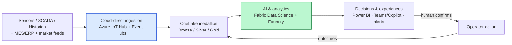
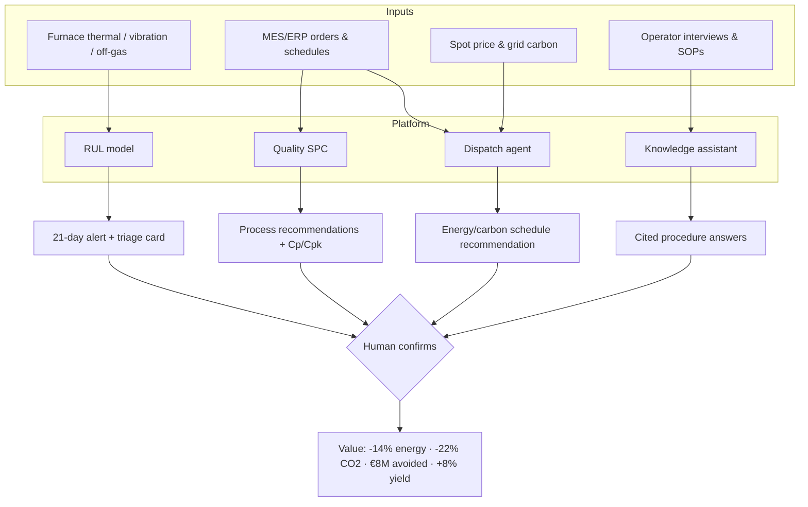

# 4. 💡 Solution Overview

*Audience: COO (1), CTO / Head of IT/OT (4), AI Architect (14), Head of Data
Science / ML Lead (13), Strategy Director (20).*

This section gives the **conceptual shape** of the solution before the detailed
architecture ([Section 5](05-target-architecture.md)) and AI design
([Section 6](06-ai-analytics-design.md)). The design philosophy is deliberately
**consolidating**: one data plane, one AI plane, one ingestion path, one governance
fabric.

---

## 4.1 End-to-end AI optimisation platform

At the highest level, the platform turns **plant telemetry into trustworthy
decisions** through five stages:

**Design tenets:**

- **Cloud-first, no edge runtime.** Telemetry lands **cloud-direct via Azure IoT
  Hub**; nothing executes on the plant-side that could affect OT safety. Telemetry
  is **one-way out** (Purdue model).
- **Single governed copy.** All plant, ERP and market data lands once in **OneLake**;
  every downstream workload reads the same governed copy (no data sprawl).
- **Recommend, don't control.** The platform never writes to control systems; it
  **recommends** and a human **confirms**.
- **EU-resident & auditable by design.** Region-pinned, lineage-tracked, logged.

## 4.2 Core capability pillars

The platform delivers **four capability pillars**, each mapped to objectives and a
named AI design.

### Pillar 1 — Predictive maintenance intelligence (O3)

A **physics-informed RUL model** fuses thermal, vibration and off-gas signals with
campaign history to predict **furnace-lining failure ≥ 21 days** ahead, with
uncertainty bounds. A lightweight **furnace-triage agent** packages each alert into
an actionable card (drivers + suggested inspection window + relevant procedures).

### Pillar 2 — Energy optimisation engine (O1, O2)

An **autonomous-but-supervised energy-dispatch agent** runs a **sense → reason → act
(recommend) → learn** loop: forecast demand, solve a **constrained schedule
(MILP/heuristic)** against spot price and grid carbon, and emit a ranked
recommendation that an operator **confirms**. The agent **never writes to control
systems**.

### Pillar 3 — Quality control AI system (O4)

**SPC-driven process recommendations** surface the settings (tap temperature,
chemistry, cooling/rolling) that **reduce variability** (Cp/Cpk), with **full
traceability** (heat/charge → coil) and digital certificates (**IATF 16949**,
**EN 10204 3.1**). **AI advises; metallurgists decide.**

### Pillar 4 — GenAI knowledge capture system (O5)

A **GenAI assistant** interviews operators (speech-to-text), structures the content
(language + document intelligence), stores it as a **procedure library** in OneLake,
and serves **grounded, cited answers** via **Foundry IQ (RAG)** in a Teams/Copilot
experience.

### Capability → objective → outcome map

| Pillar | Objective(s) | Illustrative outcome |
|--------|--------------|----------------------|
| Predictive maintenance | O3 | 21-day warning → ~€3.2M/yr avoided failures |
| Energy optimisation | O1, O2 | −14% energy (~€24.5M) · −22% CO₂ |
| Quality control AI | O4 | +8% high-grade yield |
| Knowledge capture | O5 | Durable, cited procedure library |

## 4.3 High-level value flow

## 4.4 Agentic behaviour and autonomy (why this is more than dashboards)

The solution is explicitly **agentic where it adds value, supervised where safety
demands it**:

- **Workload B (energy)** is an **autonomous optimisation agent**, not a static
  report — it closes a rolling-horizon **sense → reason → act → learn** loop, but
  autonomy is **bounded**: it emits recommendations and a human **confirms** before
  anything changes.
- A **furnace-triage agent** assembles RUL drivers, inspection windows and relevant
  procedures into one card on each 21-day alert.
- On the **delivery side**, the solution is authored and maintained by a coordinated
  team of **nine specialist GitHub Agents** under an `orchestrator` that decomposes
  work, hands off to specialists and integrates results (documented **handoff /
  reflection** pattern — see [Section 11](11-operating-model.md) and
  [`../../First_Proposal/09-github-agents.md`](../../First_Proposal/09-github-agents.md)).

## 4.5 What is deliberately out of scope

To keep the platform safe, compliant and credible:

- **No replacement** of historian/SCADA/MES systems.
- **No automated closed-loop control** without human approval (this would also push
  the furnace workload toward EU AI Act *high-risk*).
- **No change** to metallurgical certification regimes or HR decisions about staff.
- **No edge runtime** on the plant side.

---

*Continue to → [5. Target Architecture](05-target-architecture.md)*
