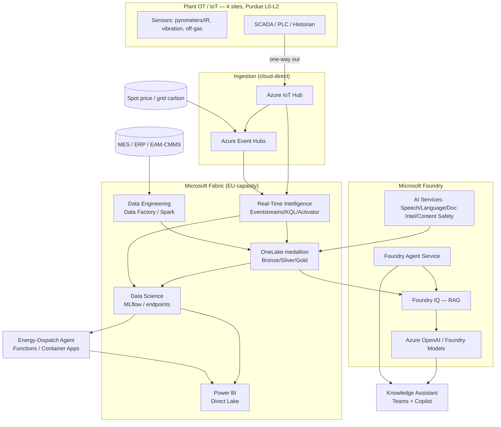

# 5. 🏗️ Target Architecture

*Audience: CTO / Head of IT/OT (4), AI Architect / Digital Twin Architect (14),
OT Engineer / Automation Engineer (15), CISO (8), CDO (12).*

The target architecture is **cloud-first, single-plane and EU-resident**, built on
**Microsoft Fabric** (data) and **Microsoft Foundry** (AI), with **Azure IoT Hub +
Event Hubs** for cloud-direct ingestion and an **Entra / Key Vault / Policy /
Purview / Defender / Monitor** governance fabric. This mirrors the **Final Decision**
in [`../1_azure_services.md`](../1_azure_services.md) and the
[C4 model](../3_c4model.md): excluded services (Azure ML, Databricks, IoT Edge/
Operations, Arc, AKS) are intentionally absent to avoid sprawl.

---

## 5.1 Conceptual architecture (cloud-first, IoT Hub ingestion)

**Principles:** one governed copy (OneLake); hot path (RTI/KQL) for sub-second
furnace alerting; cold/warm path (medallion) for features and training; all AI in
Foundry; all dashboards in Power BI Direct Lake (always fresh, no import refresh).

## 5.2 Industrial IoT layer (cloud-direct, no edge runtime)

| Concern | Decision |
|---------|----------|
| **Connectivity** | Sensors, SCADA, PLC and historian tags stream **cloud-direct via Azure IoT Hub** (per-device identity, secure). |
| **High-throughput streams** | External feeds (spot price, grid carbon) and high-rate sensor streams via **Azure Event Hubs**. |
| **OT safety** | Telemetry is **one-way out** of the plant — **no plant-side edge runtime** that could affect control. Respects the **Purdue** OT/IT boundary. |
| **Private connectivity** | **VNet + Private Link** for private PaaS access; **ExpressRoute** (or VPN) for OT/IT connectivity; **Azure Firewall** for central, segmented egress. |

> **Why cloud-direct, not IoT Edge?** It removes plant-side runtime and attack
> surface, simplifies operations, and keeps the safety story clean — at the cost of
> requiring reliable connectivity, which ExpressRoute provides.

## 5.3 Data platform (Microsoft Fabric / OneLake lakehouse)

A **medallion lakehouse** in **OneLake** is the single source of truth:

| Layer | Contents | Built by |
|-------|----------|----------|
| **Bronze** | Raw telemetry, raw MES/ERP, raw market feeds | RTI landing + Data Factory |
| **Silver** | Cleaned, conformed, time-aligned | Dataflows Gen2 / Spark |
| **Gold** | **Physics-informed features**, SPC marts, finance/emissions marts | Spark Notebooks |

- **Zero-copy integration** via **Shortcuts**; **Mirroring** for systems like SAP/ERP.
- **OneLake Catalog** for discovery and endorsement.
- **Fabric Data Warehouse / SQL analytics endpoint** for governed finance, emissions
  and quality marts.

## 5.4 AI/ML layer (Fabric Data Science + Microsoft Foundry)

| Function | Service |
|----------|---------|
| Model training, experiments, registry (MLflow), batch scoring | **Fabric Data Science** |
| Low-latency furnace scoring on live KQL features | **Fabric ML endpoint** on Real-Time Intelligence |
| LLM reasoning / summarisation / extraction | **Azure OpenAI / Foundry Models (GPT-5)** |
| Grounding / RAG over the procedure library | **Foundry IQ** (`text-embedding-3-large`) |
| Agent orchestration (knowledge & maintenance copilots) | **Foundry Agent Service** |
| Interview capture & structuring | **AI Services** — Speech, Language, Document Intelligence, Content Safety |
| Energy optimisation (MILP/heuristic) | **Azure Functions / Container Apps** |

## 5.5 Integration layer (ERP, MES, EAM systems)

- **MES / ERP** orders and heat schedules ingested via **Fabric Data Factory** (batch).
- **EAM / CMMS** maintenance work orders integrated so a **21-day alert** can raise a
  planned work order at scale.
- **Energy procurement** feeds integrated for the dispatch agent.
- **Logic Apps** orchestrate approval workflows (human-in-the-loop gates).
- Integration is **read/recommend** — the platform does not write back to control or
  to ETS reporting.

## 5.6 Visualisation & decision layer (Power BI / dashboards)

- **Power BI Direct Lake** dashboards over OneLake — **always fresh**, no import/refresh.
- Role-specific views: **executive** (energy €, tCO₂, ETS, yield), **engineering**
  (RUL drivers, SPC), **operations** (alerts, schedule recommendations).
- **Teams + Copilot** delivers the knowledge assistant directly in the operator's
  workflow, with **cited** answers.
- **Activator** triggers sub-second furnace alerts from the hot path.

## 5.8 Demo sensor simulator (telemetry generation)

For demos, pilots and pre-connection testing, a **sensor simulator** stands in for
live plant OT. It **simulates events from multiple sensors for the main components of
the steel factory and rolling mills** — EAF/BOF furnace, refractory lining, ladle,
continuous caster, reheat furnace, rolling-mill stands, cooling, and utilities — and
streams **synthetic, per-device telemetry cloud-direct via Azure IoT Hub**.

| Concern | Decision |
|---------|----------|
| **Placement** | Sits on the **left edge** of §5.1 in place of `SEN/SCADA`; **no change** to ingestion, hot path, medallion or AI/ML downstream. |
| **Hosting** | A small **Azure Functions / Container Apps** service (in-scope compute), per-device authenticated to **IoT Hub**. |
| **Realism** | Physically correlated signals (thermal, heat-flux, vibration/acoustic, electrical, off-gas, force/thickness), optional dropouts/spikes for data-quality demos. |
| **Scenarios** | Injectable wear-to-failure, vibration, off-gas drift, price spike, quality excursion — **seeded for reproducible** runs; optional accelerated campaign clock. |
| **Safety** | Every event tagged `source=simulator`; **no real plant or personal data**. |
| **To production** | Swapping in real SCADA/historian tags is a **connection change, not a redesign** — shared device identities, schema and units. |

> Full sensor/metric/scenario catalogue is in
> [15. Appendices §G](15-appendices.md#g-demo-sensor-simulator-components-sensors--metrics);
> see also the AI demo-data plan in [§6.8](06-ai-analytics-design.md).

## 5.9 Architecture decision records (key choices)

| Decision | Choice | Rationale |
|----------|--------|-----------|
| Data platform | **Microsoft Fabric / OneLake** | One governed copy; eliminates Databricks/Synapse sprawl |
| ML platform | **Fabric Data Science** (not Azure ML) | MLOps inside the data plane; one governance fabric |
| Ingestion | **IoT Hub cloud-direct** (not IoT Edge) | OT safety, lower plant-side surface |
| GenAI | **Microsoft Foundry + Foundry IQ** | EU-resident, grounded, cited, agentic |
| Hot path | **RTI/KQL + Fabric ML endpoint** | Sub-second alerts without edge |
| Region | **Sweden Central** primary (West Europe, Germany West Central alternates) | EU residency, capacity |

See the full C4 **Context** and **Container** diagrams in
[`../3_c4model.md`](../3_c4model.md) and the appendix
[15. Appendices §C](15-appendices.md#c-architecture-diagrams-detailed).

---

*Continue to → [6. AI & Analytics Design](06-ai-analytics-design.md)*
