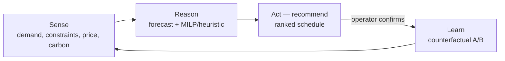

# 6. 🧠 AI & Analytics Design

*Audience: Head of Data Science / ML Lead (13), AI Architect (14), Head of Quality
(6), Head of Energy Management (7), Head of Maintenance (5), Compliance Officer (9).*

This section details the **models, framing, data, serving and metrics** for each AI
workload, plus the **MLOps** and **Responsible AI** controls that make them
defensible. It expands [`../../First_Proposal/03-data-and-ai-design.md`](../../First_Proposal/03-data-and-ai-design.md).

---

## 6.1 Physics-informed ML — furnace-lining degradation

The flagship model fuses **first-principles physics** with **machine learning** —
chosen because pure black-box models are data-hungry and hard to trust on
safety-adjacent assets, while pure physics models miss real-world variation.

| Aspect | Design |
|--------|--------|
| **Inputs** | Thermal signatures (pyrometers / IR), vibration, off-gas chemistry, campaign age, heat history, refractory batch |
| **Features** | **Physics-informed**: heat-flux estimates, wear-rate proxies, thermal gradients; plus rolling statistics & spectral features |
| **Why physics-informed** | Interpretable, **data-efficient**, generalises across campaigns, and exposes *why* it predicts wear (defensible drivers) |

## 6.2 Predictive-maintenance models (RUL + "failure within 21 days")

| Aspect | Design |
|--------|--------|
| **Problem framing** | **Remaining-Useful-Life (RUL)** regression **+** a binary *"failure within 21 days"* alert, both with **uncertainty bounds** |
| **Model family** | **Hybrid** — first-principles heat-transfer features feed **gradient-boosted / temporal** models; **survival analysis** for time-to-event |
| **Serving** | **Batch retrain** in Fabric Data Science; **Fabric ML endpoint** scored on **live Real-Time Intelligence (KQL) features** for low-latency cloud alerting |
| **Metrics** | Alert **precision/recall at the 21-day horizon**, lead-time MAE **weighted toward early warning**, false-alarm rate |
| **Proof** | **Back-test on historical failures**; track the lead-time distribution |
| **Triage agent** | On each alert, a lightweight agent assembles drivers + suggested inspection window + relevant procedures into one actionable card |

## 6.3 Energy-dispatch optimisation agent (O1/O2)

Implemented as an **autonomous optimisation agent** on a rolling horizon — a closed
**sense → reason → act (recommend) → learn** loop — not a static report.

| Aspect | Design |
|--------|--------|
| **Problem framing** | **Constrained scheduling / optimisation** over a rolling horizon |
| **Inputs** | Process energy demand (ML forecast), production constraints & deadlines, **day-ahead spot prices**, **grid-carbon intensity** |
| **Approach** | Forecast demand (ML) → solve **MILP / heuristic** schedule to minimise cost & carbon within deadlines → **recommend; operator confirms** |
| **Serving** | **Azure Functions / Container Apps**, event-triggered; recommendations to dashboards & operators |
| **Metrics** | **€/ton**, **kWh/ton** vs. baseline; **tCO₂/ton**; **% production shifted** to low-price/low-carbon windows |
| **Autonomy bound** | The agent **never writes to control systems**; a human gate precedes any change. Outcomes feed back as **counterfactual A/B** evidence |

## 6.4 Quality prediction models (O4 +8% high-grade yield)

The platform raises yield **not by automating** but by **tightening the process**:

- Surface **process-parameter recommendations** (tap temperature, chemistry,
  cooling/rolling) from **Gold-layer features**.
- Use **SPC** and capability indices (**Cp/Cpk**) to demonstrate **reduced
  variability**, not merely a shifted mean.
- Maintain **full traceability** (heat/charge → coil) and **digital quality
  certificates** aligned to **IATF 16949** and **EN 10204 3.1**.
- **AI advises; metallurgists decide** — a human-in-the-loop principle, not a slogan.

## 6.5 GenAI knowledge-capture assistant (O5; RAG via Foundry IQ)

| Aspect | Design |
|--------|--------|
| **Pattern** | Interview assistant (**Azure OpenAI / GPT-5**) → **Speech-to-text** capture → structuring (**Language**, **Document Intelligence**) → **procedure library** in OneLake → **RAG via Foundry IQ** |
| **Data** | Operator interviews, SOPs, shift logs (**anonymised**); **grounded retrieval only** |
| **Model** | **GPT-5 on Microsoft Foundry** + retrieval; **`text-embedding-3-large`** for vectors; **citations** to source procedures |
| **Serving** | **Teams + Copilot** for operators and metallurgists |
| **Metrics** | Groundedness, relevance, **answer-with-citation rate**, **human-review pass rate**, adoption/usage |
| **Proof** | Human SME evaluation set; track yield correlation over time |

## 6.6 Model lifecycle (MLOps in Fabric Data Science)

| Practice | Implementation |
|----------|----------------|
| **Experiment tracking & registry** | **MLflow** inside Fabric Data Science |
| **CI/CD** | **Git + GitHub Actions / Azure DevOps** for promotion logic and infra (Bicep/Terraform) |
| **Promotion** | **Gated** Dev → Test → Pilot (prod-like, one line) → Prod (multi-site) with approval gates |
| **Monitoring** | **Data drift**, model quality, SLO alerting via **Azure Monitor**; scheduled retraining behind approval gates |
| **Reproducibility** | Versioned datasets in **OneLake**, pinned Spark environments, lineage in **Microsoft Purview** |

### Model selection & deployment rationale

| Workload | Approach | Why | Deployment |
|----------|----------|-----|------------|
| **A — RUL** | Physics-informed features + gradient-boosted / survival | Interpretable, data-efficient, gives uncertainty + lead-time | Batch retrain (Fabric DS); Fabric ML endpoint on live RTI features |
| **B — Dispatch** | Demand forecast (ML) + MILP/heuristic optimiser | Hard constraints & deadlines need an optimiser, not just a predictor | Azure Functions / Container Apps, event-triggered |
| **C — Assistant** | **GPT-5** on Foundry + RAG via Foundry IQ | Strong reasoning with grounded, cited, EU-resident answers | Foundry endpoint; `text-embedding-3-large` |

## 6.7 Responsible AI controls (engineered, not bolted on)

| Principle | Control |
|-----------|---------|
| **Reliability & safety** | Human-in-the-loop for any safety/emissions/personnel action; **uncertainty shown** with every prediction |
| **Privacy & security** | EU residency; anonymised/synthetic demo data; lawful basis + DPIA for interviews |
| **Transparency** | Model cards, data sheets, RAG citations; **explainability on RUL drivers** |
| **Fairness & robustness** | Bias/robustness checks on the assistant; back-testing across diverse failure modes |
| **Accountability** | Named owners per workload; audit logs; **EU AI Act risk file** (see [Section 8](08-security-risk-compliance.md)) |

## 6.8 Demo data plan — the sensor simulator (safe to show)

The demo is driven by a **sensor simulator**: a small service that **simulates
events from multiple sensors for the main components of the steel factory and rolling
mills** (furnace, refractory lining, ladle, caster, reheat furnace, rolling stands,
cooling, utilities) and streams them **cloud-direct via Azure IoT Hub** — the same
path real equipment would use. It lets us prove every workload end-to-end without
touching live plant OT.

- **Synthetic furnace telemetry** with injected degradation patterns to demonstrate
  the **21-day alert live** (compressed campaign clock).
- **Per-component sensors & metrics** — thermal (°C, heat-flux), vibration/acoustic
  (RMS + spectrum), electrical (kW/kWh/MW), off-gas (CO/CO₂/O₂), force/thickness on
  the mill — physically correlated, not independent noise.
- **Public/illustrative** spot-price & grid-carbon series for energy optimisation.
- A **synthetic SOP corpus** for the knowledge assistant.
- **Injectable scenarios** (wear-to-failure, vibration spike, off-gas drift, price
  spike, quality excursion, nominal) for **reproducible, seeded** demos.
- **All demo data clearly labelled synthetic** (`source=simulator`) — no real plant
  or personal data.

> Full simulator spec — components, sensors, metrics, sample rates and scenarios — is
> in [Appendix G](15-appendices.md#g-demo-sensor-simulator-components-sensors--metrics).

---

*Continue to → [7. Data Strategy & Governance](07-data-strategy-governance.md)*
