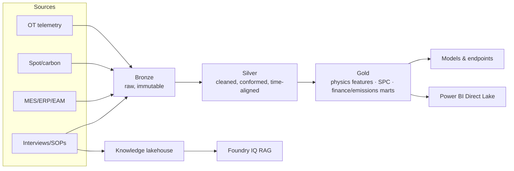
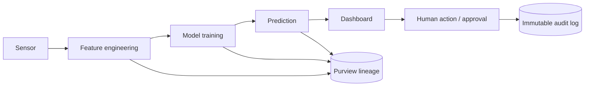

# 7. 📊 Data Strategy & Governance

*Audience: Chief Data Officer (12), CTO / Head of IT/OT (4), Data Protection Officer
(10), Compliance Officer (9), Head of Data Science / ML Lead (13).*

Data is the asset that makes every objective achievable. The strategy is **one
governed copy, lineage end-to-end, EU-resident, quality-assured** — implemented in
**OneLake** with **Microsoft Purview** as the governance backbone.

---

## 7.1 Industrial data sources

| Domain | Sources | Ingestion path |
|--------|---------|----------------|
| **Furnace / process telemetry** | Pyrometers / IR, vibration, off-gas chemistry, campaign/heat history | **Azure IoT Hub** (cloud-direct, one-way) → RTI |
| **Production / business** | MES, ERP, EAM-CMMS (orders, schedules, work orders) | **Fabric Data Factory** (batch) |
| **Energy markets** | Day-ahead **spot prices**, **grid-carbon intensity** | **Azure Event Hubs** → Eventstreams |
| **Knowledge** | Operator interviews, SOPs, shift logs (**anonymised**) | AI Services → OneLake (Knowledge lakehouse) |
| **Emissions / finance** | ETS accounting, cost data (**read-only to AI**) | Mirroring / Data Factory |

## 7.2 Data architecture and flow (medallion)

- **Bronze** preserves raw, immutable inputs (auditability).
- **Silver** conforms, time-aligns and cleanses.
- **Gold** holds **physics-informed features**, **SPC** marts, and governed
  finance/emissions marts.
- **Shortcuts** give **zero-copy** access; **Mirroring** brings in SAP/ERP without
  duplication.

## 7.3 Data quality management

Model quality is bounded by data quality, so quality is engineered upstream:

- **Data assessment in the Foundation phase** — tag inventory, profiling, historian
  connectivity, completeness checks (a named pilot exit criterion).
- **Quality rules** at Silver: range/spike checks on sensors, schema validation,
  de-duplication, time-alignment across sources.
- **Synthetic augmentation** for the demo and for sparse failure labels — produced by
  the **demo sensor simulator** that emulates the plant's main components and sensors
  (see [Appendix G](15-appendices.md#g-demo-sensor-simulator-components-sensors--metrics)).
- **Drift monitoring** at serving time (Azure Monitor) to catch input distribution
  shifts before they degrade predictions.

## 7.4 Data governance framework

| Capability | Tool | What it delivers |
|-----------|------|------------------|
| **Catalog & discovery** | OneLake Catalog, Purview | Findable, endorsed, classified data |
| **Lineage** | **Microsoft Purview** | Sensor → feature → model → prediction → dashboard → action |
| **Access control** | **Entra ID**, OneLake data-access roles | Least-privilege by domain; folder/row/column-level |
| **Secrets / keys** | **Key Vault** (BYOK) | Centralised, audited secret management |
| **Residency guardrails** | **Azure Policy** | EU-region pinning, service allow-lists |
| **Classification** | Purview sensitivity labels | PII / confidential tagging drives controls |

## 7.5 GDPR compliance considerations

Personal data appears mainly in **operator interviews, identities and access logs**.
The strategy minimises and protects it:

- **Lawful basis** documented (e.g. legitimate interest / consent) before processing.
- **Data minimisation** — capture **knowledge, not unnecessary personal data**;
  prefer **anonymisation / pseudonymisation**.
- **DPIA** completed **before** processing interview data.
- **EU residency** — personal data and embeddings **stay in EU regions**.
- **Retention & deletion** policy with **right-to-erasure** support.
- **Transparency notice** to operators; **purpose limitation**.
- **Processor terms** via the **Microsoft DPA**; sub-processor list confirmed.

(Full DPIA checklist and DPO Q&A in [Section 8](08-security-risk-compliance.md).)

## 7.6 Data lineage and traceability

End-to-end lineage is a **first-class requirement**, not a nice-to-have — it is what
makes predictions **auditable** under the EU AI Act and ETS scrutiny:

- Every **prediction, recommendation and human approval** is logged with lineage in
  **Purview / Azure Monitor** (immutable logs).
- **100% lineage traceability** is a stated governance KPI (see
  [Section 10](10-value-realisation.md)).
- This lineage underpins the answer to *"can we audit this decision?"* — **yes, with
  full provenance.**

---

## 7.7 Data strategy principles (summary)

1. **One governed copy** — land once in OneLake; everyone reads the same data.
2. **EU-resident by policy** — region-pinned, enforced, not just intended.
3. **Lineage everywhere** — sensor-to-action traceability for audit.
4. **Minimise personal data** — anonymise, retain briefly, support erasure.
5. **Quality upstream** — assess, validate and monitor before it reaches a model.
6. **Read-only where it matters** — emissions/finance data is never AI-writable.

---

*Continue to → [8. Security, Risk & Compliance](08-security-risk-compliance.md)*
