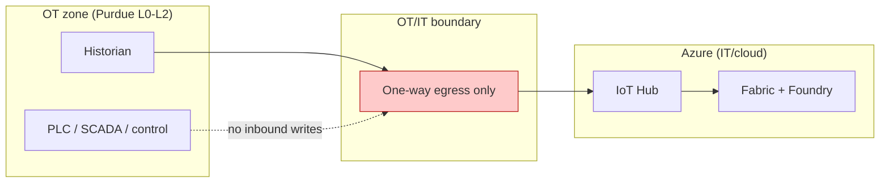

# 8. 🔐 Security, Risk & Compliance

*Audience: CISO (8), Compliance Officer (9), Data Protection Officer (10), CTO /
Head of IT/OT (4), OT Engineer (15).*

NovaSteel operates in **Luxembourg, Germany, Belgium and Spain**, so the platform
must satisfy **GDPR**, the **EU AI Act**, **EU ETS & sector directives**, and the
**Microsoft Responsible AI Standard**. This section is a **structured compliance
position** for the demo/pilot — validate with NovaSteel legal/DPO and a qualified AI
Act assessor. It expands [`../../First_Proposal/06-security-compliance.md`](../../First_Proposal/06-security-compliance.md).

---

## 8.1 Cybersecurity in industrial environments (OT/IT boundary, Purdue)

The defining safety decision: **the plant is never put at risk by the AI.**

- **Telemetry is one-way out** of the plant (OT → cloud), respecting the **Purdue
  model** OT/IT boundary (L0–L2 segmented from IT/cloud).
- **No plant-side edge runtime** — nothing the platform runs can affect control.
- **The platform never writes to control systems**; it recommends, humans confirm.
- **Defender for IoT** monitors OT threats; **Defender for Cloud** covers posture.
- **Network controls:** VNet + **Private Link** for private PaaS, **ExpressRoute**
  for OT/IT connectivity, **Azure Firewall** for segmented egress.

## 8.2 EU AI Act compliance strategy (per workload)

The Act applies tiered obligations: **unacceptable** (banned), **high-risk**
(Annex III / safety components), **limited-risk** (Article 50 transparency), and
**minimal-risk** (voluntary codes). Our mapping:

| Workload | Risk tier | Rationale | Key obligations applied |
|----------|-----------|-----------|--------------------------|
| **A — Furnace predictive maintenance** | **Minimal risk** | Industrial asset prediction; advisory only; no impact on persons' rights; not an Annex III safety component | Voluntary: risk mgmt, data governance, logging, accuracy/robustness, human oversight |
| **B — Energy-dispatch optimisation** | **Minimal risk** | Operational scheduling; recommendations only; emissions reporting untouched | Same voluntary controls; ensure ETS reporting integrity |
| **C — GenAI knowledge assistant** | **Limited risk** | Interacts with people and generates content; processes personal data | **Article 50 transparency** (users told it is AI; AI content marked), GDPR, grounding & human review |

> Under current scope **no workload is high-risk**. The classification is documented
> and **revisited if scope changes** — e.g. **automated closed-loop control** would
> push Workload A toward high-risk and trigger the full **Annex IV** obligations.
> This is the single most important reason the design keeps a **human gate** on every
> action.

## 8.3 GDPR / DPIA checklist (operator interviews)

- [ ] **Lawful basis** identified (legitimate interest / consent) and documented.
- [ ] **Data minimisation** — capture knowledge, not unnecessary personal data;
      prefer anonymisation / pseudonymisation.
- [ ] **DPIA** completed **before** processing interview data.
- [ ] **EU residency** — data and embeddings stay in EU regions.
- [ ] **Retention & deletion** policy defined; **right-to-erasure** supported.
- [ ] **Transparency** notice to operators; purpose limitation.
- [ ] **Access controls & audit** via Entra ID; logs retained.
- [ ] **Processor terms** (Microsoft DPA) in place.

## 8.4 Control mapping (obligation → control → owner → evidence)

| Obligation | Azure control | Owner | Evidence |
|-----------|---------------|-------|----------|
| Data residency | EU regions, Policy geo-restrictions | Architect | Azure Policy compliance report |
| Identity & least privilege | Entra ID, RBAC, Conditional Access, PIM | Platform | Access reviews |
| Secrets management | Key Vault, managed identities | Platform | Key Vault audit |
| Data governance & lineage | Microsoft Purview | Data lead | Lineage & classification |
| Security posture & OT threats | Defender for Cloud / Defender for IoT | Security | Secure Score, alerts |
| Logging & auditability | Azure Monitor / Log Analytics, immutable logs | Ops | Retained audit trail |
| Model transparency | Model cards, data sheets, RAG citations | AI lead | Model-card repository |
| Human oversight | Human-in-the-loop gates in workflows | Process owner | Approval records |
| Emissions integrity | Read-only feed; no AI write-back to ETS reports | Compliance | Reporting reconciliation |

## 8.5 Operational & safety-critical system risk management

| Principle | How it is met |
|-----------|---------------|
| **Reliability & safety** | Uncertainty shown; **human confirms** any safety/emissions/personnel action |
| **Fairness** | Knowledge assistant evaluated for bias; diverse failure modes in RUL back-test |
| **Privacy & security** | EU residency; synthetic/anonymised demo data; DPIA |
| **Inclusiveness** | Operator-friendly UX in Teams; multilingual support possible |
| **Transparency** | Users informed it is AI; explainable RUL drivers; cited answers |
| **Accountability** | Named owners; AI Act risk file; audit logs; steering oversight |

## 8.6 Compliance Officer & DPO Q&A (plain language)

- **"Where is our data?"** — In **EU Azure regions**; personal data never leaves the EU.
- **"Is this a high-risk AI system?"** — Based on current scope, **no**; documented
  and revisited if we add automated control.
- **"Can the AI mis-report emissions?"** — **No**; emissions data is **read-only** to
  the AI; optimisation recommendations are separate and human-approved.
- **"Can we audit decisions?"** — **Yes**; every prediction, recommendation and
  approval is logged with lineage in Purview/Monitor.
- **"What about retiring operators' data?"** — Covered by a **DPIA**, lawful basis,
  minimisation, retention limits and erasure support.

## 8.7 Open items to confirm

- Final **lawful basis & DPIA sign-off** with the DPO.
- **AI Act classification** reviewed by a qualified assessor.
- **Data-processing agreement** and sub-processor list confirmed.

---

*Continue to → [9. Implementation Roadmap](09-implementation-roadmap.md)*
