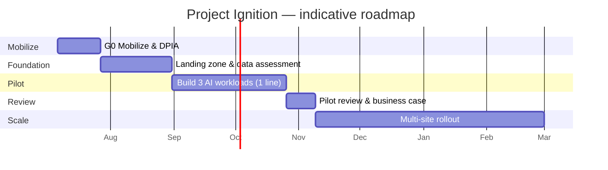

# 9. 🚀 Implementation Roadmap

*Audience: COO (1), Head of Manufacturing / VP Operations (2), Plant Director (3),
PMO / Product Owner, CTO / Head of IT/OT (4), CFO (19).*

Delivery is **phased and gated**: prove the percentages on one line before any
multi-site commitment. Cadence is **2-week iterations with a demo every iteration**.
Durations are planning estimates to confirm in a delivery workshop. This expands
[`../../First_Proposal/04-implementation-plan.md`](../../First_Proposal/04-implementation-plan.md).

---

## 9.0 Phasing overview & decision gates

```text
G0 Mobilize ─► G1 Pilot design ─► G2 Pilot live ─► G3 Pilot review ─► G4 Scale decision
```



| Gate | Question answered | Decision owner |
|------|-------------------|----------------|
| **G1** | Is scope, DPIA and team ready? | Steering committee |
| **G2** | Is telemetry flowing and secure? | CTO / IT-OT + CISO |
| **G3** | Do the workloads work on the pilot line? | COO + role owners |
| **G4** | Do we scale to four sites? | Steering committee (go/no-go) |

## 9.1 Phase 0 — Mobilize (≈3 weeks) → Gate G1

- Confirm scope, **KPIs and baselines**, and the team; set up the steering committee.
- Start the **DPIA** and **EU AI Act** risk classification.
- Provision the dev subscription; agree **EU regions** and the security baseline.
- **Exit:** signed charter, data-access agreement, pilot line selected.

## 9.2 Phase 1 — Foundation (≈5 weeks) → Gate G2

- Deploy the **landing zone** via IaC (networking, identity, policy, monitoring).
- Stand up the **Fabric / OneLake medallion lakehouse** and **cloud-direct IoT Hub**
  ingestion (no edge runtime).
- **Data assessment:** tag inventory, quality profiling, historian connectivity.
- Build the **demo sensor simulator** and **synthetic-data generators** for the demo —
  multi-sensor events for furnace, caster, rolling mill and utilities, streamed
  cloud-direct via IoT Hub (see [§G](15-appendices.md#g-demo-sensor-simulator-components-sensors--metrics)).
- **Exit:** telemetry flowing to Bronze/Silver; **security baseline passed**.

## 9.3 Phase 2 — Pilot build (≈8 weeks) → Gate G3

- **Workload A** — RUL furnace model + Real-Time Intelligence alerting; **back-test**
  on history.
- **Workload B** — energy-dispatch agent with spot-price / carbon feeds.
- **Workload C** — knowledge-capture assistant (RAG) on synthetic SOPs.
- Dashboards (Power BI / Fabric) and the operator **Teams/Copilot** experience.
- **MLOps** pipelines, monitoring, Responsible AI documentation.
- **Exit:** live demo proves the **21-day alert**, **energy savings** and **yield
  insights**.

## 9.4 Phase 3 — Pilot review (≈2 weeks) → Gate G4

- Measure against KPIs; update the **cost & ROI** model.
- Executive review with role owners; **go / no-go for scale**.

## 9.5 Phase 4 — Scale (≈16 weeks)

- Roll out across the remaining lines and **four sites**.
- Integrate with **CMMS/ERP** (maintenance work orders) and **energy procurement**;
  harden **MLOps**; operator **enablement & change management**.

## 9.6 Workstreams

1. **Platform & landing zone** (IaC, security, networking)
2. **Data engineering** (ingestion, medallion, governance)
3. **AI/ML** (three workloads, MLOps, Responsible AI)
4. **Experience** (dashboards, Copilot, operator UX)
5. **Compliance & governance** (DPIA, AI Act, Purview)
6. **Adoption & change management**

## 9.7 Team & RACI (summary)

| Role | Build | Decisions |
|------|-------|-----------|
| Microsoft CSA / Solution Architect | Architecture, enablement | **A** on design |
| Data/AI Engineers | Models, pipelines | **R** on AI quality |
| Data/Platform Engineers | Landing zone, Fabric, ingestion | **R** on platform |
| NovaSteel metallurgist (SME) | Features, validation | **A** on quality |
| NovaSteel energy manager (SME) | Constraints, baselines | **A** on energy |
| NovaSteel maintenance lead (SME) | Failure labels | **A** on maintenance |
| Compliance / DPO | DPIA, AI Act file | **A** on compliance |
| Product Owner | Backlog | **A** on priorities |

## 9.8 Change management & workforce upskilling (9.4–9.5 of the TOC)

Adoption is the difference between a working model and a *used* model:

- **Co-design with operators** — the people who hold the know-how shape the tools.
- **Human-in-the-loop by design** — the AI augments, never replaces, the operator's
  judgement (also the message for **Union Representatives (17)** and **Worker
  Councils**).
- **Role-based enablement** — operators (Teams assistant), engineers (RUL/SPC),
  executives (KPI dashboards).
- **Upskilling path** — from "reading dashboards" to "validating models", building
  the internal capability the **AI Center of Excellence** ([Section 11](11-operating-model.md)) sustains.

## 9.9 Definition of Done (pilot)

- **21-day furnace alert** demonstrated on back-tested data with stated precision.
- **Energy/CO₂ savings** modelled against a documented baseline.
- **Knowledge assistant** answers with **citations** and passes SME review.
- **Security baseline, DPIA and AI Act risk file** complete.
- Updated **TCO/ROI** and a jury-ready **deck & demo**.

---

*Continue to → [10. Value Realisation](10-value-realisation.md)*
