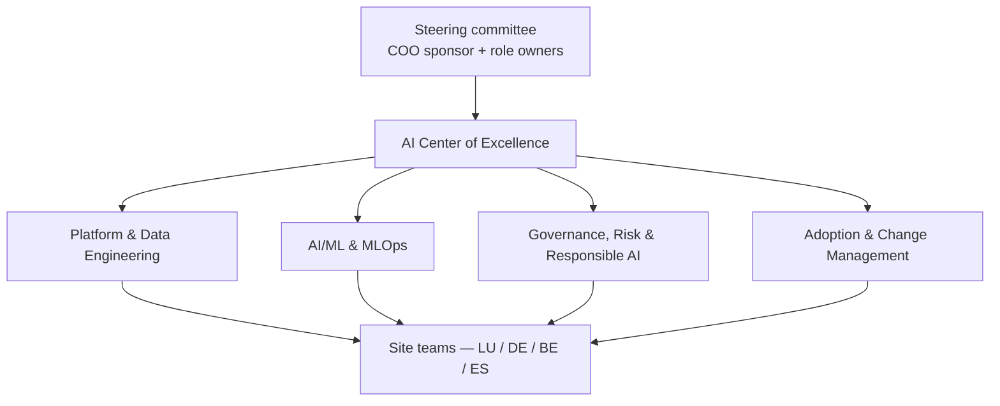
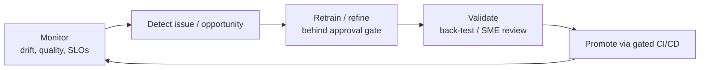

# 11. 🧪 Operating Model

*Audience: COO (1), CDO (12), Head of Data Science / ML Lead (13), CTO / Head of
IT/OT (4), Head of HR / Workforce Transformation (16), Strategy Director (20).*

A platform only creates durable value if it is **owned, governed and continuously
improved**. This section defines how NovaSteel runs the platform after the pilot —
the people, the ownership of models, and the loop that keeps them trustworthy.

---

## 11.1 AI Center of Excellence (CoE) structure

A lightweight **AI Center of Excellence** is the durable home for the platform —
federated, not centralised, so each site keeps ownership while sharing standards.



| CoE function | Mandate |
|--------------|---------|
| **Platform & Data Engineering** | Landing zone, Fabric/OneLake, ingestion, reliability |
| **AI/ML & MLOps** | Model build, registry, drift monitoring, retraining |
| **Governance, Risk & Responsible AI** | Purview lineage, AI Act file, DPIA, audit |
| **Adoption & Change Management** | Enablement, operator UX, upskilling |

## 11.2 Roles & responsibilities (IT / OT / Data / Operations)

| Domain | Owns | Key roles |
|--------|------|-----------|
| **Operations** | Acting on recommendations; furnace/energy/quality decisions | COO, Plant Director, operators, metallurgists |
| **OT** | Sensor/historian connectivity, OT safety boundary | OT Engineer / Automation Engineer (15), CTO/IT-OT (4) |
| **Data** | Data quality, lineage, governance, cross-plant strategy | CDO (12), data engineers |
| **AI/ML** | Model quality, MLOps, Responsible AI | Head of Data Science / ML Lead (13), AI Architect (14) |
| **Risk & Compliance** | AI Act, GDPR, audit, ESG integrity | CISO (8), Compliance Officer (9), DPO (10), ESG (11) |
| **Finance** | TCO, ROI, FinOps | CFO (19) |

**Decision rights:** the **Steering committee** approves gates and budget; the
**Product Owner** prioritises the backlog; the **Architecture Review Board** approves
design changes. Steering members: COO (sponsor), VP Operations, CTO/IT-OT, Head of
Quality, Head of Energy, ESG, Compliance, DPO, CFO, Microsoft CSA.

## 11.3 Model ownership and governance

Each AI workload has a **named owner** accountable for its quality, drift and
compliance file — there are no orphan models:

| Workload | Model owner | Governance artefacts |
|----------|-------------|----------------------|
| A — Furnace RUL | Maintenance + ML Lead | Model card, back-test report, uncertainty spec |
| B — Energy dispatch | Energy Manager + ML Lead | Optimiser constraints doc, A/B evidence |
| C — Knowledge assistant | HR/Operations + AI Lead | Article 50 transparency, SME eval set, citations |
| Quality SPC | Head of Quality | Cp/Cpk reports, traceability records |

Models are **versioned in Fabric Data Science (MLflow)**, promoted through **gated
CI/CD**, and **monitored for drift and quality** (Azure Monitor). Every change is
traceable in **Purview**.

## 11.4 Continuous improvement loop



- **Scheduled retraining** behind approval gates; **no silent model swaps**.
- **Counterfactual A/B** evidence (energy agent) feeds the next horizon.
- **SME evaluation sets** keep the knowledge assistant grounded and trustworthy.
- **KPI review** at each steering cadence keeps benefits honest.

## 11.5 Vendor & ecosystem strategy — and agentic delivery

**Platform stance:** a **consolidated Microsoft stack** (Fabric + Foundry + Azure
governance) minimises integration surface and gives a single governance plane.
Microsoft acts as platform vendor under the **DPA**; NovaSteel retains data
ownership and EU residency.

**Agentic delivery model (the operating model for building the solution itself):**
the solution is authored and maintained by a coordinated team of **nine specialist
GitHub Agents** under an **`orchestrator`** coordinator — a documented **handoff /
reflection** multi-agent pattern (see
[`../../First_Proposal/09-github-agents.md`](../../First_Proposal/09-github-agents.md)):

| Agent | Persona | Owns |
|-------|---------|------|
| `solution-architect` | Cloud & AI Solution Architect | Solution architecture |
| `data-platform-engineer` | Fabric & IoT data platform | Fabric/IoT architecture |
| `azure-data-expert` | Azure data (cross-cutting) | Consistency across data/AI |
| `ai-ml-engineer` | AI/ML Engineer | Data & AI design |
| `business-value-cfo` | Business value / finance | Cost & ROI |
| `compliance-officer` | Compliance & Responsible AI | Security & compliance |
| `quality-engineer` | Steel quality & process | Quality sections |
| `demo-implementation` | Demo implementation | Demo script |
| `presentation-storyteller` | Executive storyteller | Presentation deck |

```text
orchestrator ─► architect ─► data-platform ─► azure-data-expert
                        ├─► ai-ml-engineer
                        ├─► business-value-cfo
                        ├─► compliance-officer
                        └─► quality-engineer ─► demo-implementation ─► storyteller
```

**Candidate future agents:** a **FinOps** agent (Azure cost optimisation), an
**Adoption & Change Management** agent, and an **OT Security** agent (Defender for
IoT / Purdue hardening).

---

## 11.6 Operating-model principles

1. **Federated ownership** — sites own outcomes; the CoE owns standards.
2. **Named accountability** — every model has an owner and a compliance file.
3. **No silent changes** — gated promotion, monitored drift, audited lineage.
4. **Human-in-the-loop** — operating discipline, not just architecture.
5. **Consolidated stack** — one platform, one governance plane, less risk.

---

*Continue to → [12. Technology Stack](12-technology-stack.md)*
