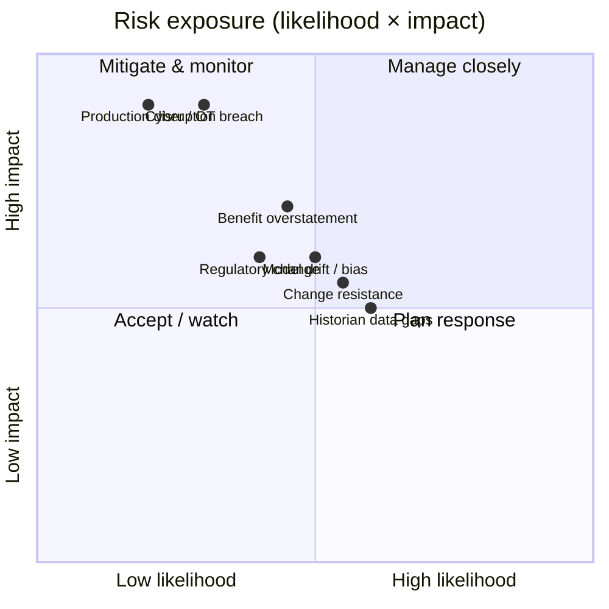

# 13. ⚠️ Risks & Mitigation

*Audience: COO (1), CISO (8), Compliance Officer (9), CFO (19), Head of Maintenance
(5), Product Owner / PMO.*

Every risk below is paired with a **concrete, already-designed mitigation** — the
programme's credibility rests on honest risk treatment, not optimism.

---

## 13.0 Risk heat map

## 13.1 Model risk (drift, bias, reliability)

| Aspect | Mitigation |
|--------|------------|
| **Drift** | Continuous **data-drift & model-quality monitoring** (Azure Monitor); scheduled retraining behind approval gates |
| **Bias** | Bias/robustness checks on the knowledge assistant; **diverse failure modes** in RUL back-test |
| **Reliability** | **Uncertainty bounds** with every prediction; **back-testing** on historical failures; physics-informed features for data efficiency |
| **Reproducibility** | Versioned datasets (OneLake), MLflow registry, pinned environments, Purview lineage |

## 13.2 Operational risk (production disruption)

| Aspect | Mitigation |
|--------|------------|
| **Plant safety** | **Telemetry one-way out**; **no edge runtime**; platform **never writes to control systems** |
| **Disruption** | Pilot on **one line**, prod-like, before any scale; gated rollout, no big-bang cutover |
| **Human gate** | Operators **confirm** every energy/maintenance/quality action |
| **Resilience** | Cloud hot path (RTI) for alerting; ExpressRoute for reliable connectivity |

## 13.3 Cyber risk

| Aspect | Mitigation |
|--------|------------|
| **OT/IT boundary** | **Purdue** segmentation; one-way ingestion; **Defender for IoT** |
| **Posture** | **Defender for Cloud** Secure Score; **Azure Policy** guardrails |
| **Identity** | **Entra ID** least-privilege, Conditional Access, **PIM** |
| **Secrets** | **Key Vault** (BYOK), managed identities |
| **Network** | VNet + Private Link, Azure Firewall segmented egress |

## 13.4 Change resistance

| Aspect | Mitigation |
|--------|------------|
| **Operator adoption** | **Co-design** with operators; **human-in-the-loop** by design; training |
| **Workforce relations** | Engage **Union Representatives (17)** / Worker Councils early — AI augments, never replaces |
| **Usability** | Assistant in **Teams** (existing workflow); cited, trustworthy answers |
| **Trust** | Explainable RUL drivers; uncertainty shown; metallurgists decide |

## 13.5 Compliance & financial risk

| Aspect | Mitigation |
|--------|------------|
| **Regulatory (AI Act)** | **Conservative** risk classification (no high-risk in scope); revisit on scope change; DPO/assessor validation |
| **GDPR** | DPIA before processing; minimisation; EU residency; erasure support |
| **Emissions integrity** | ETS reporting **read-only** to AI; human-approved recommendations |
| **Benefit overstatement** | **Conservative** estimates; proof via **SPC** and **back-testing**; treat O3 frequency as **upside** |
| **Azure cost overrun** | Reservations / savings plans, capacity right-sizing, dev/test shutdown, **FinOps** |
| **Scope creep** | **Gated governance**; fixed pilot scope |

## 13.6 Consolidated risk register

| ID | Risk | Likelihood | Impact | Owner | Primary mitigation |
|----|------|-----------|--------|-------|--------------------|
| R1 | Historian data gaps | Med | Med | CDO / Data lead | Foundation-phase assessment; synthetic augmentation |
| R2 | OT security / safety | Low | High | CISO / OT Eng | Purdue, one-way ingestion, Defender for IoT |
| R3 | Operator adoption | Med | Med | HR / Ops | Co-design, human-in-the-loop, training |
| R4 | Regulatory change (AI Act) | Med | Med | Compliance / DPO | Conservative classification; assessor validation |
| R5 | Benefit overstatement | Med | High | CFO / ML Lead | Conservative estimates; SPC & back-test proof |
| R6 | Model drift / bias | Med | Med | ML Lead | Drift monitoring; gated retraining; bias checks |
| R7 | Production disruption | Low | High | COO / Plant Dir | One-line pilot; no control writes; human gate |
| R8 | Azure cost overrun | Med | Med | CFO / Platform | Reservations, right-sizing, FinOps |
| R9 | Scope creep | Med | Med | Product Owner | Gated governance; fixed pilot scope |

> **Net risk posture:** the highest-impact risks (cyber, production disruption) are
> **low likelihood** by design — they are engineered out via the OT/IT boundary, the
> no-edge / no-control-write stance, and the human gate. The residual risks are
> **delivery and benefit-proof** risks, which the **gated pilot** is purpose-built to
> retire.

---

*Continue to → [14. Key Recommendations](14-key-recommendations.md)*
