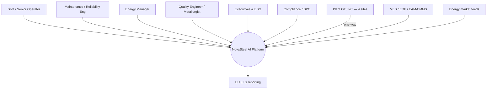
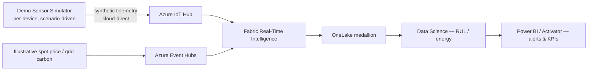

# 15. 📎 Appendices

*Reference material supporting the main analysis (Sections 0–14).*

- [A. Glossary (industrial + AI terms)](#a-glossary-industrial--ai-terms)
- [B. KPI definitions](#b-kpi-definitions)
- [C. Architecture diagrams (detailed)](#c-architecture-diagrams-detailed)
- [D. Data schema overview](#d-data-schema-overview)
- [E. Model technical specifications](#e-model-technical-specifications)
- [F. EU ETS overview and assumptions](#f-eu-ets-overview-and-assumptions)
- [G. Demo sensor simulator (components, sensors & metrics)](#g-demo-sensor-simulator-components-sensors--metrics)

---

## A. Glossary (industrial + AI terms)

| Term | Definition |
|------|------------|
| **BF / BOF / EAF** | Blast Furnace / Basic-Oxygen Furnace / Electric-Arc Furnace — primary steelmaking routes |
| **Refractory lining** | Heat-resistant lining of a furnace; its wear drives the RUL prediction |
| **Campaign** | The operating life of a furnace lining between relines |
| **Historian** | OT system storing time-series plant tags (sensor readings) |
| **SCADA / PLC** | Supervisory control & data acquisition / programmable logic controller — plant control systems |
| **MES / ERP / EAM-CMMS** | Manufacturing execution / enterprise resource planning / enterprise asset & maintenance management |
| **Purdue model** | Reference OT/IT segmentation model (levels L0–L5) for industrial security |
| **RUL** | Remaining Useful Life — predicted time before an asset fails |
| **Physics-informed ML** | ML using first-principles features (heat-flux, gradients) for interpretability & data efficiency |
| **MILP** | Mixed-Integer Linear Programming — optimisation for constrained scheduling |
| **SPC / Cp / Cpk** | Statistical Process Control and process-capability indices for variability |
| **RAG** | Retrieval-Augmented Generation — grounding an LLM in retrieved source documents |
| **MLOps** | Engineering practice for the ML lifecycle (train, register, deploy, monitor) |
| **OneLake** | Microsoft Fabric's unified, governed data lake |
| **Medallion** | Bronze (raw) / Silver (cleaned) / Gold (curated features) lakehouse pattern |
| **Real-Time Intelligence (RTI)** | Fabric's streaming/KQL workload for hot-path analytics |
| **Foundry / Foundry IQ** | Microsoft Foundry AI platform / its grounding & RAG capability |
| **Direct Lake** | Power BI mode reading OneLake directly (always fresh, no import) |
| **DPIA** | Data Protection Impact Assessment (GDPR) |
| **EU AI Act** | EU regulation classifying AI systems by risk tier |
| **EU ETS / CBAM** | Emissions Trading System / Carbon Border Adjustment Mechanism |
| **IATF 16949 / EN 10204 3.1** | Automotive quality management standard / inspection-certificate standard |
| **Human-in-the-loop** | A human confirms before any safety/emissions/personnel action |

## B. KPI definitions

| KPI | Definition | Target | Measurement source |
|-----|-----------|--------|--------------------|
| **Energy per ton** | Energy cost & consumption per tonne produced | **−14%** | €/t, kWh/t vs. baseline (A/B) |
| **CO₂ per ton** | Emissions intensity per tonne | **−22%** | tCO₂/t; carbon-aware scheduling % |
| **Furnace alert lead time** | Days between alert and predicted failure | **≥ 21 days** | Back-test lead-time distribution |
| **Alert precision/recall** | Quality of the 21-day alert | High precision, early recall | Confusion matrix at 21-day horizon |
| **High-grade yield** | Saleable high-grade output / input | **+8%** | Yield vs. baseline + Cp/Cpk |
| **Knowledge adoption** | Assistant usage & coverage | Live & adopted | Usage telemetry; SME pass rate |
| **Groundedness / citation rate** | Share of grounded, cited answers | High | Eval set scoring |
| **Lineage traceability** | Auditable sensor→action provenance | **100%** | Purview lineage; audit-log completeness |
| **Payback** | Time to recover build+run cost | **< 12 months** | TCO/ROI model |

## C. Architecture diagrams (detailed)

The authoritative **C4 model** (Context → Containers → Components) lives in
[`../3_c4model.md`](../3_c4model.md). Key views:

### C.1 Layered reference (Fabric / IoT)

| Layer | Key components | Outcome |
|-------|----------------|---------|
| 1 Foundation & Storage | OneLake, Shortcuts, Mirroring, OneLake Catalog | Single governed copy |
| 2 Data Engineering | Data Factory, Pipelines, Dataflows Gen2, Spark Notebooks | Physics-informed Gold features |
| 3 Data Science & AI | Data Science, Experiments/Models, AI functions, Copilot, Fabric data agents | RUL + energy forecast + NL data agent |
| 4 Warehouse & DB | Fabric Data Warehouse, SQL DB, SQL Analytics Endpoint | Governed finance/emissions/quality marts |
| 5 Real-Time Intelligence | Eventstreams, Eventhouse/KQL, Activator, anomaly detection, digital-twin builder | Sub-second furnace alerts |
| 6 Business Intelligence | Power BI, Direct Lake | Always-fresh dashboards |
| 7 Governance & Admin | Purview, Entra, Fabric Admin, Git/DevOps | Lineage, EU residency, AI Act traceability |

### C.2 System context (personas & external systems)

### C.3 Container view

See [`../3_c4model.md` §2 — Containers](../3_c4model.md) for the full
`C4Container` diagram (IoT Hub, Event Hubs, the Fabric boundary — RTI, OneLake, Data
Engineering, Data Science, Power BI — the Foundry boundary — Agent Service, Foundry
IQ, Models, AI Services — the Energy-Dispatch Agent, the Knowledge Assistant, and the
Governance & Ops plane: Entra+Key Vault, Purview+Policy, Azure Monitor).

## D. Data schema overview

Indicative domains in the **Gold** layer (to be detailed in the design workshop):

| Domain | Representative entities | Key fields (illustrative) |
|--------|------------------------|---------------------------|
| **Furnace telemetry** | `heat`, `thermal_reading`, `vibration`, `offgas` | heat_id, timestamp, temp, heat_flux, gradient, vibration_spectrum |
| **Campaign / asset** | `furnace`, `campaign`, `refractory_batch` | furnace_id, campaign_age, reline_date, batch_id |
| **Energy** | `process_demand`, `spot_price`, `grid_carbon`, `schedule_rec` | timestamp, kWh, €/MWh, gCO2/kWh, window, status |
| **Quality** | `coil`, `spc_measure`, `certificate` | coil_id, heat_id, Cp, Cpk, grade, cert_ref |
| **Knowledge** | `procedure`, `interview`, `citation` | proc_id, source, anonymised_author, embedding_ref |
| **Lineage / audit** | `prediction`, `recommendation`, `approval` | id, model_version, input_ref, human_decision, timestamp |

Traceability chain: **heat/charge → coil** (quality) and **sensor → feature → model →
prediction → dashboard → human action** (governance).

## E. Model technical specifications

| Workload | Model family | Inputs | Serving | Key metrics |
|----------|-------------|--------|---------|-------------|
| **A — Furnace RUL** | Physics-informed features → gradient-boosted / temporal + survival analysis | Thermal, vibration, off-gas, campaign age, heat history, refractory batch | Batch retrain (Fabric DS) + **Fabric ML endpoint** on live KQL features | Precision/recall @21d, lead-time MAE (early-weighted), false-alarm rate |
| **B — Energy dispatch** | ML demand forecast + **MILP/heuristic** optimiser | Demand forecast, constraints/deadlines, day-ahead spot price, grid carbon | **Azure Functions / Container Apps**, event-triggered; recommend → human confirm | €/t, kWh/t, tCO₂/t, % shifted to low-price/carbon |
| **C — Knowledge assistant** | **GPT-5** (Foundry) + RAG (Foundry IQ); `text-embedding-3-large` | Interviews, SOPs, shift logs (anonymised) | Foundry endpoint; Teams + Copilot | Groundedness, relevance, citation rate, SME pass rate, adoption |
| **Quality SPC** | SPC + capability analysis | Gold process features | Power BI + recommendations | Cp/Cpk, yield vs. baseline |

**Cross-cutting:** versioned in **Fabric DS / MLflow**; promoted via **gated CI/CD**;
monitored for **drift & quality** (Azure Monitor); reproducible via OneLake
versioning + Purview lineage; **uncertainty bounds** on every prediction.

## F. EU ETS overview and assumptions

| Item | Assumption / note (illustrative) |
|------|----------------------------------|
| **Mechanism** | EU ETS prices CO₂ per tonne; free-allowance phase-down + **CBAM** raise exposure |
| **Carbon price** | ~**€70/tCO₂** (replace with NovaSteel's actual/forward curve) |
| **CO₂ reduction lever** | **−22%** via carbon-aware dispatch (run flexible load in low-carbon windows) |
| **Reporting integrity** | Emissions reporting is **read-only** to the AI; optimisation is separate & human-approved; reconciliation evidence retained |
| **Benefit** | Avoided ETS penalty cost **+** verifiable sustainability narrative for customers/investors |
| **Caveat** | Site-specific; confirm tonnage, tCO₂/t and price during the design workshop |

## G. Demo sensor simulator (components, sensors & metrics)

To run the platform end-to-end **without connecting to live plant OT**, the demo
ships a **sensor simulator**: a lightweight service that **simulates events from
multiple sensors for the main components of the steel factory and rolling mills** and
streams them, **cloud-direct via Azure IoT Hub**, exactly as real equipment would.
It is the safe, repeatable data source behind the §6.8 demo-data plan, the §7.3
synthetic augmentation, and the §9.2 *"build synthetic-data generators"* task.

> **All simulator output is clearly labelled `synthetic`** (a `source=simulator`
> tag on every event) — no real plant, personal or customer data is ever used.

### G.1 What it does

- Emulates a fleet of **per-device** sensors (one IoT Hub identity per simulated
  device) across the **main steelmaking components** below.
- Generates **physically plausible** time series (correlated temperatures, heat-flux,
  vibration, off-gas, energy) rather than independent random noise.
- **Injects scenarios on demand** — e.g. a refractory-wear ramp that drives the
  **21-day furnace alert**, a vibration spike, an off-gas drift, or an energy-price
  spike — so every workload can be demonstrated live and reproducibly.
- Runs from a **seeded** configuration for **deterministic, repeatable** demos, with
  an optional **accelerated clock** to compress a furnace campaign into minutes.

### G.2 Main components & their sensors

| # | Plant component | Simulated sensors | Representative metrics (units) | Nominal sample rate |
|---|-----------------|-------------------|--------------------------------|---------------------|
| 1 | **Electric-Arc / Basic-Oxygen Furnace (EAF/BOF)** | Pyrometers / IR cameras, shell thermocouples, electrode current & voltage, off-gas analyser | Bath/shell temperature (°C), **heat-flux** (kW/m²), thermal gradient (°C/cm), electrode current (kA), active power (MW), tap temperature (°C) | 1 Hz (thermal), 50 Hz (electrical) |
| 2 | **Refractory lining** *(the RUL asset)* | Embedded thermocouples, IR shell scanning, derived wear proxy | Hot-face/cold-face temperature (°C), heat-flux trend (kW/m²), **wear-rate proxy** (mm/heat), campaign age (heats) | per-heat + 1 Hz thermal |
| 3 | **Ladle / secondary metallurgy** | Thermocouples, stirring/argon flow, weigh cells | Steel temperature (°C), argon flow (Nm³/h), ladle mass (t), holding time (s) | 1 Hz |
| 4 | **Continuous caster** | Mould thermocouples, cooling-water flow/temp, level sensor, casting-speed encoder | Mould temperature (°C), water flow (m³/h), ΔT water (°C), mould level (mm), casting speed (m/min) | 1–10 Hz |
| 5 | **Reheat furnace** | Zone thermocouples, fuel-gas flow, O₂/air ratio | Zone temperatures (°C), fuel flow (Nm³/h), air/fuel ratio, slab residence (min) | 1 Hz |
| 6 | **Hot rolling mill (stands)** | Load cells (roll force), motor current, roll-gap & strip-thickness gauges, tensiometers, accelerometers, acoustic emission | **Rolling force** (MN), motor power (MW), roll gap (mm), strip thickness (mm) & deviation (µm), strip tension (kN), strip speed (m/s), **vibration RMS / spectrum** (mm/s) | 1 Hz process, **1–10 kHz vibration** |
| 7 | **Cooling & run-out table** | Thermal cameras, water headers flow/pressure | Strip temperature profile (°C), water flow (m³/h), header pressure (bar) | 1–5 Hz |
| 8 | **Utilities & energy** | Plant power meters, compressed-air & cooling-water meters, off-gas dust/emissions | **Electrical energy** (kWh, MW), compressed-air flow (Nm³/h), cooling-water flow (m³/h), off-gas CO/CO₂/O₂ (%), dust (mg/Nm³) | 1 Hz / 1 min |

### G.3 Signal characteristics & metrics it emits

- **Process metrics** (1 Hz): temperatures, flows, pressures, levels, speeds.
- **High-frequency metrics** (1–10 kHz): vibration waveforms and acoustic emission
  for the rolling mill and rotating equipment, downsampled to **RMS + spectral
  bands** before streaming.
- **Electrical / energy metrics**: per-component **kW / kWh**, plant **MW**, power
  factor — the inputs for the energy-dispatch agent (paired with **public/illustrative
  spot-price and grid-carbon** series).
- **Derived / physics-informed metrics**: heat-flux, thermal gradients, wear-rate
  proxy and campaign age — the same **Gold-layer features** the RUL model consumes.
- **Per-heat / per-coil events**: heat start/stop, tap, cast, coil produced — carrying
  `heat_id` / `coil_id` so the **heat → coil traceability chain** (App. D) is intact.
- **Data-quality realism**: optional dropouts, out-of-range spikes and clock skew so
  the **Silver-layer quality rules** (§7.3) can be demonstrated, not just assumed.

### G.4 Built-in demo scenarios (injectable)

| Scenario | What the simulator injects | Workload demonstrated |
|----------|----------------------------|-----------------------|
| **Refractory wear → failure** | Gradual heat-flux / hot-face-temperature ramp over a compressed campaign | **A — 21-day furnace RUL alert** |
| **Vibration / bearing fault** | Rising spectral peak on a mill stand | A — anomaly + maintenance triage |
| **Off-gas drift** | Shift in CO/CO₂/O₂ ratios | A — process anomaly detection |
| **Price / carbon spike** | High-cost, high-carbon window in the market feed | **B — energy-dispatch optimisation** |
| **Quality excursion** | Tap-temperature / thickness variability increase | **Quality SPC** (Cp/Cpk, yield) |
| **Nominal / steady state** | Healthy baseline for A/B and false-alarm checks | Baseline & precision/recall |

### G.5 How it fits the architecture

- **No architecture change**: the simulator simply takes the place of plant OT on the
  **left edge** of the §5.1 diagram, so the **exact same** ingestion, hot path,
  medallion and AI/ML pipeline is exercised end-to-end.
- **Deployment**: a small **Azure Functions / Container Apps** service (the in-scope
  compute), seeded from config, that authenticates per-device to **IoT Hub**.
- **From demo to real**: swapping the simulator for live SCADA/historian tags is a
  **connection change, not a redesign** — the contract (device identities, message
  schema, units) is shared.

---

## Source artefacts

This analysis synthesises the following companion documents under `docs/usecase/`:

- [Use case](../../usecase.md) · [Immutable brief](../../usecase_immutable.md)
- [0_architecture.md](../0_architecture.md) · [1_azure_services.md](../1_azure_services.md) · [3_c4model.md](../3_c4model.md)
- First Proposal pack: [00](../../First_Proposal/00-executive-summary.md) · [01 charter](../../First_Proposal/01-project-charter.md) · [02 architecture](../../First_Proposal/02-solution-architecture.md) · [02a Fabric/IoT](../../First_Proposal/02a-fabric-iot-architecture.md) · [03 data & AI](../../First_Proposal/03-data-and-ai-design.md) · [04 plan](../../First_Proposal/04-implementation-plan.md) · [05 cost](../../First_Proposal/05-cost-estimate.md) · [06 security](../../First_Proposal/06-security-compliance.md) · [09 agents](../../First_Proposal/09-github-agents.md) · [10 roles](../../First_Proposal/10-target-audience-roles.md)
- [Rating grid](../../10_oral_defense/rating_grid.md)

---

*Return to → [README / index](README.md) · [0. Executive Summary](00-executive-summary.md)*
