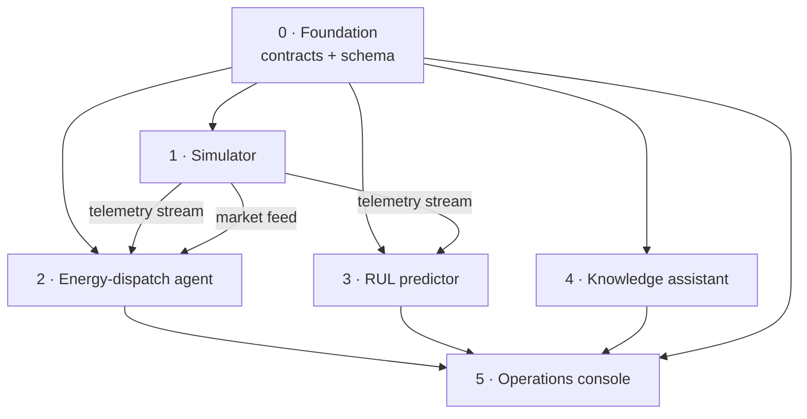

# 00 · Brainstorm — Platform Decomposition

> **Superpowers phase:** `brainstorming` → *decompose before designing*.
> The request ("implement the whole platform end-to-end") describes multiple
> independent subsystems. The brainstorming skill mandates decomposition first:
> *"If the project is too large for a single spec, help the user decompose into
> sub-projects: what are the independent pieces, how do they relate, what order
> should they be built?"*

## 1. Why decompose

The NovaSteel platform combines four distinct AI workloads (from
[usecase.md](../usecase.md) §AI Infusion Point) plus a shared data foundation and
a human-facing surface. Each has a different runtime, test strategy, and owner.
Forcing them into one spec would violate YAGNI and make TDD impractical. So we
split into **six sub-projects**, each independently buildable and testable.

## 2. Sub-projects

| # | Sub-project | One-line purpose | KPI link | Runtime |
| --- | --- | --- | --- | --- |
| 0 | **Platform foundation** | Shared telemetry contracts, event schema, message bus abstractions, test fixtures | enabler | .NET class libs + Python package |
| 1 | **Steel factory simulator** | Emit realistic synthetic furnace / mill / utility telemetry + market feeds | feeds 2·3·4 | .NET worker service |
| 2 | **Energy-dispatch agent** | Schedule energy-intensive steps around spot price + grid carbon | −14% energy, −22% CO₂ | Python solver + .NET API |
| 3 | **Furnace-lining RUL predictor** | Physics-informed remaining-useful-life + "fail within 21 days" alert | 21-day warning | Python ML service |
| 4 | **Knowledge-capture assistant** | Operator interviews → structured, searchable procedure library + grounded Q&A | preserve expertise | Python AI service |
| 5 | **Operations console** | Unified web surface: KPIs, alerts, dispatch approval, assistant chat | cross-cutting | Next.js + .NET BFF |

## 3. Dependency graph

**Build order rationale:**

1. **Foundation first** — every other sub-project consumes the shared telemetry
   contract and event envelope. Locking these interfaces early prevents churn.
2. **Simulator second** — produces the data that the three AI workloads consume.
   Without it, downstream components have nothing to test against. It also lets us
   work entirely offline (no live Azure IoT Hub needed during development).
3. **AI workloads (2 → 3 → 4)** in the use case's stated priority order. Each is
   independent of the others and depends only on Foundation + Simulator.
4. **Operations console last** — it aggregates the outputs of the workloads, so it
   needs them to exist (or be stubbed behind the Foundation contracts).

## 4. Scope guardrail (services in play)

Per [1_azure_services.md](../0_preliminary%20analysis/1_azure_services.md) Final
Decision — **only the focused core**:

- **Microsoft Fabric** — OneLake (medallion), Real-Time Intelligence, Data Science.
- **Microsoft Foundry** — Agent Service, Foundry IQ, Azure OpenAI / Models, AI Services.
- **IoT (minimal)** — Azure IoT Hub + Event Hubs (cloud-direct; no edge runtime).
- **App/integration** — Azure Functions + Azure Container Apps.
- **Governance/ops** — Entra ID, Key Vault, Policy, Purview, Defender, Monitor,
  VNet + Private Link, ADLS Gen2 / OneLake + Blob.

**Explicitly excluded** (do not introduce): Azure ML, Databricks, IoT Edge/Operations,
Data Factory standalone, Stream Analytics, ADX standalone, AKS, VMs, Arc, Azure DevOps.

## 5. Local-first development strategy

Cloud services are **abstracted behind Foundation interfaces** so the whole
platform runs locally for TDD without provisioning Azure:

| Production service | Local development stand-in |
| --- | --- |
| Azure IoT Hub / Event Hubs | In-process channel / local Kafka-compatible emulator |
| Fabric OneLake | Local Parquet/Delta folder under `.data/` |
| Fabric Real-Time Intelligence (KQL) | In-memory time-series store |
| Fabric Data Science (ML endpoint) | Local Python FastAPI scoring service |
| Foundry Agent Service / Models | Pluggable `IChatModel` + recorded fixtures |

The seam is the **`ITelemetrySink` / `ITelemetrySource`** abstraction defined in
Sub-project 0. Swapping local ↔ Azure is configuration, not code change.

## 6. Acceptance — what "done" means per sub-project

Each sub-project is complete when:

- Its spec requirements all map to passing tests (see its plan's traceability table).
- `dotnet test` / `pytest` is green from a clean checkout.
- A code review (in [reviews/](reviews/)) reports no Critical or High issues open.

---

**Next:** [01-master-design.md](01-master-design.md) — the platform-level design
presented in sections, then per-sub-project specs in [specs/](specs/).
