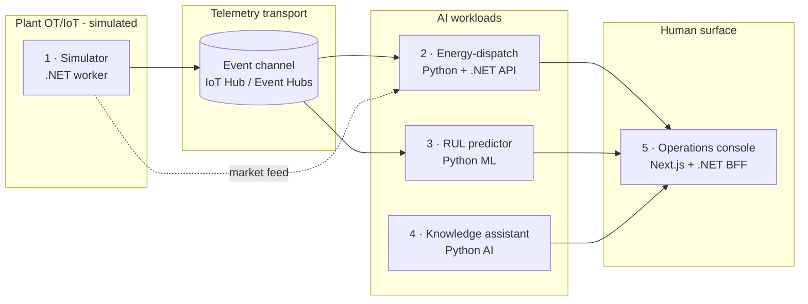

# 01 · Master Design

> **Superpowers phase:** `brainstorming` → *present the design in sections*.
> This is the platform-level design. Each section is scaled to its complexity and
> is the parent context for the per-sub-project specs in [specs/](specs/).
> Grounded in the C4 model ([3_c4model.md](../0_preliminary%20analysis/3_c4model.md)).

## Section A — Architecture (recommended approach)

**Three approaches considered:**

| Approach | Summary | Trade-off | Verdict |
| --- | --- | --- | --- |
| **A. Monolith** | One .NET app hosting all workloads | Simple deploy, but couples Python ML to .NET, blocks independent scaling/testing | ❌ violates decomposition |
| **B. Cloud-only** | Build straight on Fabric + Foundry, no local seam | Closest to prod, but slow TDD, needs Azure for every test, costly | ❌ violates evidence-fast TDD |
| **C. Local-first, contract-driven microservices** ✅ | Each sub-project is a service behind shared contracts; cloud is a swappable adapter | Slightly more upfront interface design | ✅ **recommended** — enables TDD, isolation, YAGNI |

**Chosen: Approach C.** Each sub-project is an independently deployable unit that
communicates through the Foundation contracts. In production these map onto Azure
Container Apps / Functions; in development they run in-process or via `docker compose`.



## Section B — Components & responsibilities

| Component | Tech | Responsibility | Consumes | Produces |
| --- | --- | --- | --- | --- |
| Foundation contracts | C# `NovaSteel.Contracts` | Telemetry/event/alert records, enums, `ITelemetrySource/Sink` | — | DTOs used by all |
| Foundation Python pkg | `novasteel_core` | Same schema in Python (pydantic) + fixtures | — | DTOs used by 2·3·4 |
| Simulator | C# worker | Physics-plausible telemetry + day-ahead market feed | contracts | telemetry stream |
| Energy-dispatch agent | Python solver (`pulp`/heuristic) + C# API | Schedule energy steps to low-price/low-carbon windows; human-in-loop | telemetry, market, forecast | dispatch plan + rationale |
| RUL predictor | Python (`scikit-learn` + physics features) | RUL regression + "fail ≤21d" classifier | telemetry | RUL + alert |
| Knowledge assistant | Python (transcription → structuring → grounded RAG) | Interview capture → procedure library → cited answers | interviews, procedures | structured SOPs + answers |
| Operations console | Next.js + C# BFF | KPI dashboard, alert feed, dispatch approval, assistant chat | all workload outputs | operator actions |

## Section C — Data flow & contracts

**Canonical telemetry envelope** (defined once in Foundation, shared verbatim):

```jsonc
// TelemetryReading
{
  "assetId": "LU-BF1",          // plant-furnace identifier
  "assetType": "BlastFurnace",  // BlastFurnace | RollingMill | Utility
  "site": "LU",                 // LU | DE | BE | ES
  "metric": "ThermocoupleTemp", // enum of measured signals
  "value": 1487.2,
  "unit": "C",
  "timestamp": "2026-06-21T10:00:00Z",
  "quality": "Good"             // Good | Suspect | Bad
}
```

**Market feed envelope** (drives the energy agent):

```jsonc
// MarketSignal
{ "market": "LU", "timestamp": "...", "spotPriceEurMwh": 92.4, "gridCarbonGramsPerKwh": 310 }
```

Flow: `Simulator → telemetry transport → {Energy, RUL} → Operations console`.
The Knowledge assistant flow is offline-batch (interviews) + on-demand query.

## Section D — Error handling & resilience

- **Bad/suspect telemetry** is tagged `quality` at source and filtered, never dropped
  silently (auditability requirement, EU AI Act).
- **Human-in-the-loop**: the energy agent and assistant *recommend*; they never
  actuate. Every recommendation carries a rationale and is logged.
- **Backpressure**: the transport abstraction buffers; the simulator honours a
  configurable rate so tests are deterministic.
- **Model uncertainty**: RUL predictions include a confidence band; low confidence
  suppresses the 21-day alert rather than crying wolf.

## Section E — Testing strategy (TDD, non-negotiable)

| Layer | Tool | What we test |
| --- | --- | --- |
| C# units | xUnit + FluentAssertions | contracts, simulator physics ranges, dispatch API, BFF |
| Python units | pytest | schema parity, RUL features/model, solver, assistant pipeline |
| Contract parity | golden JSON fixtures shared C#↔Python | envelopes serialise identically |
| Integration | docker compose smoke | simulator → agent → console happy path |

Every task in the [plans/](plans/) follows RED → GREEN → REFACTOR → commit.

## Section F — Repository layout (target)

```
NovaSteel/
├─ apps/
│  ├─ steel_factory_simulator/        # 1 · .NET worker (already stubbed)
│  └─ operations_console/             # 5 · Next.js + .NET BFF
├─ services/
│  ├─ energy_dispatch/                # 2 · Python solver + .NET API
│  ├─ rul_predictor/                  # 3 · Python ML
│  └─ knowledge_assistant/            # 4 · Python AI
├─ libs/
│  ├─ NovaSteel.Contracts/            # 0 · C# shared contracts
│  └─ novasteel_core/                 # 0 · Python shared package
├─ infrastructure/                    # existing Bicep (target Azure mapping)
└─ docs/usecase/1_agentic_work/       # this SDD workspace
```

## Section G — Azure production mapping (deferred, YAGNI)

Each local component maps to an in-scope service. We build local-first and wire
Azure only when a component is proven:

| Component | Azure target |
| --- | --- |
| Simulator | Container Apps job → Azure IoT Hub |
| Transport | Azure IoT Hub + Event Hubs |
| Energy agent | Azure Functions / Container Apps |
| RUL predictor | Fabric Data Science endpoint |
| Knowledge assistant | Foundry Agent Service + IQ + AI Services |
| Console | Container Apps + Entra ID auth |

Existing [infrastructure/](../../../infrastructure/) Bicep already provisions this set.

---

## Design self-review

- ✅ No placeholders / TBDs.
- ✅ Consistent with scope guardrail (no excluded services).
- ✅ Decomposed into independently testable units.
- ✅ Contracts named consistently with specs (`TelemetryReading`, `MarketSignal`).

**Next:** per-sub-project specs in [specs/](specs/), starting with
[specs/00-foundation-spec.md](specs/00-foundation-spec.md).
