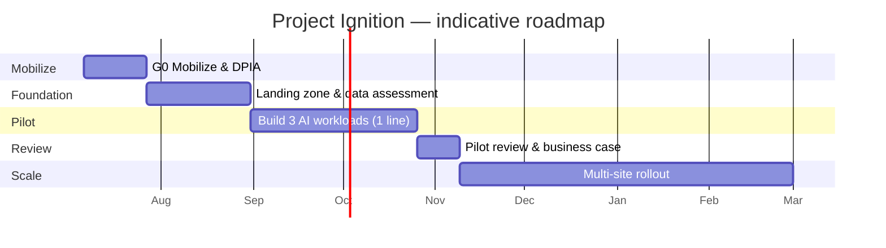

# 04 — Implementation Plan

**Project Ignition** — phased delivery roadmap from mobilization to multi-site
scale.

> Durations are **planning estimates** for a demo/pilot context and should be
> confirmed in a delivery workshop. Cadence: **2-week iterations with a demo
> every iteration.**

Role alignment follows [10 — Target audience roles](10-target-audience-roles.md),
with phase gates reviewed by the relevant priority owners.

---

## 1. Phases & timeline

## 2. Phase detail

### Phase 0 — Mobilize (≈3 weeks) → **Gate G1**

- Confirm scope, KPIs, baselines, and team; set up steering committee.
- Start **DPIA** and EU AI Act risk classification ([06](06-security-compliance.md)).
- Provision dev subscription; agree EU regions and security baseline.
- **Exit:** signed charter, data-access agreement, pilot line selected.

### Phase 1 — Foundation (≈5 weeks) → **Gate G2**

- Deploy **landing zone** via IaC (networking, identity, policy, monitoring).
- Stand up **Fabric/OneLake** medallion lakehouse and **cloud-direct IoT Hub**
  telemetry ingestion (no edge runtime).
- **Data assessment**: tag inventory, quality profiling, historian connectivity.
- Build synthetic-data generators for the demo.
- **Exit:** telemetry flowing to Bronze/Silver; security baseline passed.

### Phase 2 — Pilot build (≈8 weeks) → **Gate G3**

- **Workload A** — RUL furnace model + Real-Time Intelligence alerting; back-test on history.
- **Workload B** — energy-dispatch agent with spot-price/carbon feeds.
- **Workload C** — knowledge-capture assistant (RAG) on synthetic SOPs.
- Dashboards (Power BI/Fabric) and operator Teams/Copilot experience.
- MLOps pipelines, monitoring, Responsible AI documentation.
- **Exit:** live demo proves 21-day alert, energy savings, yield insights.

### Phase 3 — Pilot review (≈2 weeks) → **Gate G4**

- Measure against KPIs; update the [cost & ROI model](05-cost-estimate.md).
- Executive review with role owners; go/no-go for scale.

### Phase 4 — Scale (≈16 weeks)

- Roll out across the remaining lines and four sites.
- Integrate with **CMMS/ERP** (maintenance work orders) and **energy
  procurement**; harden MLOps; operator enablement & change management.

## 3. Team (RACI summary)

| Role | Build | Decisions |
| ---- | ----- | --------- |
| Microsoft CSA / Solution Architect | Architecture, enablement | A on design |
| Data/AI Engineers | Models, pipelines | R on AI quality |
| Data/Platform Engineers | Landing zone, Fabric, ingestion | R on platform |
| NovaSteel metallurgist (SME) | Features, validation | A on quality |
| NovaSteel energy manager (SME) | Constraints, baselines | A on energy |
| NovaSteel maintenance lead (SME) | Failure labels | A on maintenance |
| Compliance/DPO | DPIA, AI Act file | A on compliance |
| Product Owner | Backlog | A on priorities |

## 4. Workstreams

1. **Platform & landing zone** (IaC, security, networking)
2. **Data engineering** (ingestion, medallion, governance)
3. **AI/ML** (three workloads, MLOps, Responsible AI)
4. **Experience** (dashboards, Copilot, operator UX)
5. **Compliance & governance** (DPIA, AI Act, Purview)
6. **Adoption & change management**

## 5. Top risks & mitigations

| Risk | Mitigation |
| ---- | ---------- |
| Historian data gaps | Foundation-phase assessment; synthetic augmentation |
| OT security/safety | Purdue segmentation, one-way ingestion, Defender for IoT |
| Operator adoption | Co-design, human-in-the-loop, training |
| Regulatory change | Conservative AI Act classification; DPO validation |
| Scope creep | Gated governance; fixed pilot scope |

## 6. Definition of Done (pilot)

- 21-day furnace alert demonstrated on back-tested data with stated precision.
- Energy/CO₂ savings modelled against a documented baseline.
- Knowledge assistant answers with citations and passes SME review.
- Security baseline, DPIA and AI Act risk file complete.
- Updated TCO/ROI and a jury-ready deck & demo.
