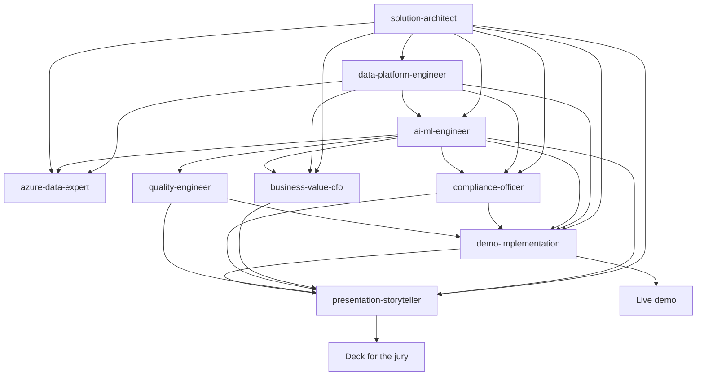

# 09 — GitHub Agents Guide

**Project Ignition** — the custom GitHub Agents that build and maintain this
demo, and how to use them.

> The agents live in [`.github/agents/`](../../.github/agents/). Each is a
> persona with a focused mission, aligned to one or more roles in the target audience.

Role alignment source: [10 — Target audience roles](10-target-audience-roles.md).

---

## 1. The agents

All agents should use the canonical role names in
[10 — Target audience roles](10-target-audience-roles.md) verbatim and keep
their executive messaging consistent with
[07 — Presentation deck](07-presentation-deck.md).

| Agent file | Persona | Owns (in `docs/usecase/First_Proposal/`) | Primary target roles | Deck touchpoints |
| ---------- | ------- | ------------------------------- | -------------------- | ---------------- |
| `solution-architect.md` | Cloud & AI Solution Architect | `02-solution-architecture.md` | COO (1), Head of Manufacturing / VP Operations (2), Plant Director / Site Manager (3), CTO / Head of IT/OT (4) | Slides 4, 6, 14, 16 |
| `data-platform-engineer.md` | Microsoft Fabric & IoT Data Platform | `02a-fabric-iot-architecture.md` | CTO / Head of IT/OT (4), CISO (8), Chief Data Officer (CDO) (12), OT Engineer / Automation Engineer (15) | Slides 6, 14, 15 |
| `azure-data-expert.md` | Azure Data Expert (Fabric + IoT + Apps + AI) | cross-cutting across `02`, `02a`, `03` (coordinates, does not own) | CTO / Head of IT/OT (4), CISO (8), Chief Data Officer (CDO) (12), Head of Data Science / ML Lead (13), AI Architect / Digital Twin Architect (14), OT Engineer / Automation Engineer (15) | Slides 6, 14, 15 |
| `ai-ml-engineer.md` | AI/ML Engineer | `03-data-and-ai-design.md` | Head of Quality (6), Head of Energy Management (7), Head of Data Science / ML Lead (13) | Slides 7, 8, 9, 15 |
| `business-value-cfo.md` | Business Value / Finance | `05-cost-estimate.md` | COO (1), Head of Energy Management (7), Head of Sustainability / ESG (11), CFO (19) | Slides 5, 12, 16 |
| `compliance-officer.md` | Compliance & Responsible AI | `06-security-compliance.md` | CISO (8), Compliance Officer (9), Data Protection Officer (DPO) (10) | Slides 13, 16 |
| `quality-engineer.md` | Steel Quality & Process | quality sections of `01`/`03` | Head of Manufacturing / VP Operations (2), Plant Director / Site Manager (3), Head of Quality (6) | Slides 9, 10, 16 |
| `demo-implementation.md` | Demo Implementation | `08-demo-script.md` | COO (1), Head of Manufacturing / VP Operations (2), Head of Quality (6), Compliance Officer (9), Data Protection Officer (DPO) (10), Head of Sustainability / ESG (11), CFO (19) | Slide 15, proof claims on 5, 13, 16 |
| `presentation-storyteller.md` | Executive Storyteller | `07-presentation-deck.md` | COO (1), Head of Manufacturing / VP Operations (2), Head of Quality (6), Head of Sustainability / ESG (11), Compliance Officer (9), Data Protection Officer (DPO) (10), CFO (19) | Slides 1–16 |

## 2. How they fit together

The **architect** sets the technical frame; the **data-platform engineer** builds
the Microsoft Fabric + IoT data plane; the **AI/ML** and **quality** engineers
detail the workloads; the **Azure data expert** keeps Fabric, IoT, apps and AI
consistent end to end across those pillars; **business value** and **compliance**
make it investable and defensible; the **demo-implementation** agent turns those
building blocks into an executable walkthrough; and the **storyteller** assembles
the jury-ready deck.

## 3. Using the agents

These are **GitHub Copilot custom agents** defined as Markdown files with YAML
front matter (`name`, `description`, optional `tools`) followed by instructions.

- **Invoke** an agent by selecting it (e.g. `@solution-architect`) in a
  Copilot-enabled surface that supports custom agents, then give it a task such
  as *"update the architecture for a second furnace line"*.
- **Chain** them: run the architect first, then the AI/ML engineer, then the
  business-value and compliance agents, then the demo-implementation agent, and
  finally the storyteller to refresh the deck around the live demo.
- Each agent reads `README.md` and the relevant files in `docs/usecase/First_Proposal/`
  for context and writes back to the document it owns.
- When an agent mentions a jury role, it should use the canonical names from
  `10-target-audience-roles.md` rather than aliases such as "DPO" alone or
  legacy titles.

## 4. Conventions the agents follow

- Keep all figures **labelled as illustrative demo estimates**.
- Keep personal/operator data **in the EU**; never propose exporting it.
- Keep humans in the loop for any safety, emissions or personnel decision.
- Align numbers across docs (architecture ↔ cost ↔ compliance ↔ deck).
- Keep role references and deck touchpoints aligned with
  `10-target-audience-roles.md` and `07-presentation-deck.md`.

## 5. Extending the set

Add a new agent by creating `.github/agents/<name>.md` with the same front-matter
pattern. Remaining candidate additions: a **FinOps** agent (deep Azure cost
optimization), an **Adoption & Change Management** agent, or an **OT Security**
agent (Defender for IoT / Purdue-model hardening).
