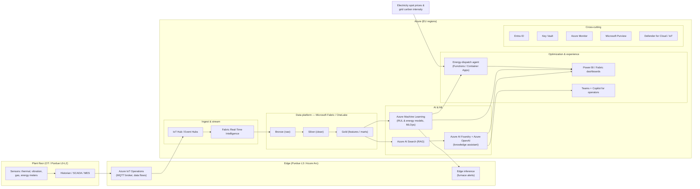

# 02 — Solution Architecture

**Project Ignition** — Azure reference architecture for the NovaSteel AI
production-optimization platform.

> Designed against the **Azure Well-Architected Framework** (Reliability,
> Security, Cost Optimization, Operational Excellence, Performance Efficiency)
> and the **Cloud Adoption Framework**. Default regions: **West Europe** and
> **Germany West Central** for EU data residency.

---

## 1. Architecture at a glance

> **Editable diagram:** an Excalidraw version of the Fabric + IoT view is at
> [`../images/fabric-iot-architecture.excalidraw`](../images/fabric-iot-architecture.excalidraw)
> — open it in [aka.ms/excalidraw](https://aka.ms/excalidraw) to edit or export.

## 2. Layer-by-layer

### 2.1 Plant floor (OT) and edge
- **Sources:** thermal cameras/pyrometers, vibration, off-gas analyzers, energy
  meters, plus the **historian/SCADA/MES**.
- **Azure IoT Operations** on an **Azure Arc**-enabled edge cluster provides an
  MQTT broker and data flows. The OT/IT boundary follows the **Purdue model**;
  ingestion is **one-way out** of the plant for safety.
- **Edge inference** keeps furnace alerts low-latency and resilient to
  connectivity loss.

### 2.2 Ingestion & streaming
- **IoT Hub / Event Hubs** for device telemetry; **Fabric Real-Time
  Intelligence** for streaming analytics and hot-path alerting.

### 2.3 Data platform (Microsoft Fabric / OneLake)
- **Medallion** architecture: **Bronze** (raw), **Silver** (validated, modelled),
  **Gold** (curated features and marts) on **OneLake / ADLS Gen2**.
- Lineage and classification through **Microsoft Purview**.

### 2.4 AI & ML
- **Azure Machine Learning** trains and serves the **physics-informed RUL model**
  (furnace lining) and the **energy-optimization model**, with full **MLOps**
  (registry, CI/CD, drift & quality monitoring).
- **Azure AI Foundry + Azure OpenAI** power the **knowledge-capture assistant**,
  grounded with **Azure AI Search** (RAG) over the procedure library.

### 2.5 Optimization & experience
- **Energy-dispatch agent** (Azure Functions / Container Apps) consumes
  day-ahead spot prices and grid carbon intensity and recommends scheduling.
- **Power BI / Fabric dashboards** for executives and engineers; **Teams +
  Copilot** surface guidance to operators.

### 2.6 Cross-cutting (security, governance, operations)
- **Microsoft Entra ID** (identity, conditional access), **Key Vault** (secrets),
  **Azure Monitor / Log Analytics** (observability), **Microsoft Purview**
  (governance & lineage), **Defender for Cloud / Defender for IoT** (posture &
  OT threat detection). Private networking via **VNet + Private Endpoints**.

### 2.7 Microsoft Fabric estate (detail)

The data platform above is realised on **Microsoft Fabric** over **OneLake** —
one logical copy of data, many engines (hot, warm and cold paths). The full
component-by-component design is in
[02a — Fabric + IoT architecture](02a-fabric-iot-architecture.md); in brief, the
seven Fabric capability layers map to NovaSteel as:

| Layer | Fabric / IoT components | Role at NovaSteel |
| ----- | ----------------------- | ----------------- |
| Foundation & storage | OneLake, Shortcuts, Mirroring, OneLake Catalog | One governed copy of plant + ERP + market data |
| Data engineering | Data Factory, Pipelines, Dataflows Gen2, Spark notebooks | Physics-informed Gold features, reproducible |
| Data science & AI | Synapse Data Science, Experiments/Models, Copilot, AI agents | RUL + energy forecast + NL data agent |
| Warehouse & DB | Data Warehouse, SQL Analytics Endpoint | Governed finance / emissions / quality marts |
| Real-Time Intelligence | Eventstreams, KQL/Eventhouse, Activator | Sub-second furnace alerts, live telemetry (IoT hot path) |
| Business intelligence | Power BI, Direct Lake | Always-fresh exec / engineer / ops dashboards |
| Governance & admin | Purview, Entra, Fabric Admin, Git/DevOps | Lineage, EU residency, EU AI Act traceability |

The **edge inference / Azure ML** split is unchanged: Fabric Data Science owns
feature engineering, experiment tracking and batch scoring; **Azure ML** owns the
production registry, CI/CD, drift monitoring and **edge serving** of the hot-path
furnace model.

## 3. Mapping services to business outcomes

| Outcome | Primary services | How |
| ------- | ---------------- | --- |
| 21-day furnace warning (O3) | IoT Operations, AML, edge inference | RUL model on thermal/vibration features, alerted on the hot path |
| −14% energy (O1) | Dispatch agent, AML, Event Hubs | Schedule energy-intensive steps around spot price / carbon |
| −22% CO₂ (O2) | Dispatch agent, Fabric, Purview | Carbon-aware scheduling + auditable emissions data |
| +8% yield (O4) | Fabric (Gold features), AML, Power BI | Process-parameter recommendations + SPC dashboards |
| Knowledge capture | AI Foundry, Azure OpenAI, AI Search | Interview assistant + RAG procedure library |

## 4. Well-Architected highlights

- **Reliability:** edge buffering and inference survive cloud disconnects;
  multi-zone services; IaC for reproducible environments.
- **Security:** EU residency, private endpoints, Entra ID, least privilege,
  Defender, secrets in Key Vault, OT segmentation.
- **Cost optimization:** consumption-based services, Fabric capacity sizing,
  reservations/savings plans as levers (see [05](05-cost-estimate.md)).
- **Operational excellence:** MLOps + DevOps, full observability, runbooks.
- **Performance efficiency:** hot path at the edge/stream, batch training in the
  cloud.

## 5. Environments

`Dev → Test → Pilot (prod-like, one line) → Production (multi-site)`, all
provisioned via **Infrastructure as Code** (Bicep/Terraform) with separated
subscriptions/resource groups and policy guardrails (Azure Policy).

## 6. Key assumptions

- Historian exposes the needed tags; edge cluster can be deployed plant-side.
- EU regions satisfy residency; external price/carbon feeds are licensed.
- These are **demo/reference assumptions** to be confirmed in a design workshop.
