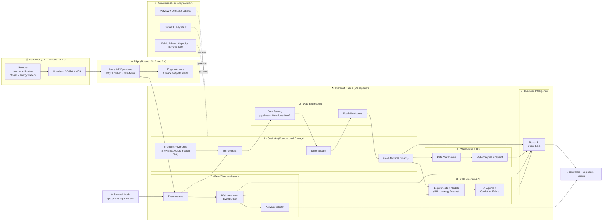
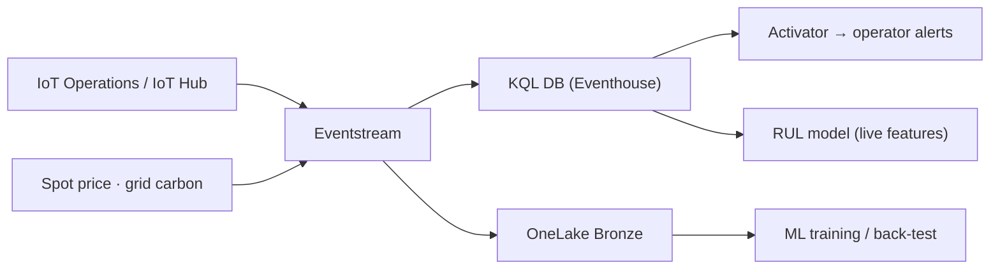

# 02a — Microsoft Fabric + IoT Architecture

**Project Ignition** — a **Microsoft Fabric**–centric, **IoT**-driven reference
architecture for the NovaSteel AI production-optimization platform.

> This document complements [02 — Solution Architecture](02-solution-architecture.md).
> Doc 02 gives the broad Azure picture; this document zooms into the **Microsoft
> Fabric** estate and the **IoT ingestion path** that feed NovaSteel's three AI
> workloads. It is organised around the seven Fabric capability layers.
>
> Designed against the **Azure Well-Architected Framework** and the **Cloud
> Adoption Framework**. Default capacity region: **West Europe**, with **Germany
> West Central** as the secondary region for EU data residency. All figures are
> **illustrative demo estimates**.

**Primary target roles:** CTO / Head of IT/OT (4), CISO (8),
Chief Data Officer (12), Head of Data Science / ML Lead (13),
AI Architect / Digital Twin Architect (14), OT Engineer / Automation Engineer (15).

**Editable diagram:** [`../images/fabric-iot-architecture.excalidraw`](../images/fabric-iot-architecture.excalidraw)
— open in [aka.ms/excalidraw](https://aka.ms/excalidraw) to edit or export to PNG/SVG.

---

## 0. Why Fabric + IoT for NovaSteel

NovaSteel runs blast furnaces and rolling mills across four countries. The hard
problems — **furnace-lining failure**, **energy/CO₂ cost**, **high-grade yield**,
**retiring expertise** — all need the *same* data plane: high-frequency sensor
telemetry, plant historian data, ERP/MES context, and external market signals,
unified and governed.

**Microsoft Fabric** gives that single, SaaS, OneLake-backed data plane (one copy
of data, many engines), and **Real-Time Intelligence** gives the hot path for IoT
sensor streams. This lets us run the **hot path** (sub-second furnace alerts),
the **warm path** (operational analytics), and the **cold path** (ML training,
BI) on one logical lake without copying data between silos.

---

## 1. Foundation & Storage — *OneLake*

The single, tenant-wide data lake. **One logical copy** of NovaSteel data, open
**Delta/Parquet** format, consumed by every Fabric engine without duplication.

| Capability | NovaSteel use |
| --- | --- |
| **OneLake** | One lakehouse per domain (Furnace, Energy, Quality, Knowledge). **Medallion** zones — Bronze (raw sensor/historian), Silver (validated, conformed), Gold (features & marts). |
| **Shortcuts** | Virtualise data **without copying**: ADLS Gen2 historian archives, SAP/ERP exports, and external **spot-price / grid-carbon** datasets surfaced in-place into OneLake. Cross-workspace shortcuts share Gold features to the BI and DS teams. |
| **Mirroring** | Fabric-**managed near-real-time replication** of the operational **MES/ERP databases** (e.g. Azure SQL / PostgreSQL / Snowflake) into OneLake — production orders, heat schedules, refractory batch master data — with no custom ETL. (A managed copy lands in OneLake; this is replication, not virtualization.) |
| **OneLake Catalog** | Tenant catalog to **discover, explore and govern** every lakehouse, KQL DB and warehouse item; the entry point operators and analysts use to find trusted, certified datasets. |

### Design choices (Foundation & Storage)

- **Domains & workspaces** map to NovaSteel's data domains so ownership, access
  and lineage stay clean (a "data mesh" on one lake).
- Bronze keeps **immutable raw** telemetry for replay/back-testing model changes.
- **Shortcuts/Mirroring** keep ERP/MES and market data close to source —
  Shortcuts are **zero-copy** virtualization; Mirroring is managed replication
  that avoids custom ETL and keeps a single, always-fresh authoritative feed.

---

## 2. Data Engineering & Integration — *Data Factory + Synapse Data Engineering*

Moves and shapes data from Bronze → Silver → Gold.

| Capability | NovaSteel use |
| --- | --- |
| **Data Factory — Pipelines** | Orchestrate batch ingestion of historian extracts, refractory/heat master data and daily market files; schedule and trigger Bronze→Silver→Gold runs; copy activity from 100+ connectors. |
| **Dataflows Gen2** | Low-code cleansing & conforming of plant tags (unit harmonisation, tag-name mapping across the four sites, deduplication) for analysts who don't write Spark. |
| **Synapse Data Engineering** | Lakehouse home for the medallion build; manages the Spark compute and Delta tables. |
| **Notebooks (Spark)** | PySpark transforms that compute **physics-informed features** — heat-flux estimates, thermal gradients, vibration spectral features, rolling statistics — and assemble the **Gold feature tables** consumed by ML. |
| **Spark environment management** | Pinned **environments** (libraries, Spark pool sizing, session config) per workload so feature engineering for the RUL model is reproducible and CI-promotable across Dev→Test→Prod. |

### Design choices (Data Engineering)

- **Pipelines orchestrate; Notebooks compute.** Heavy/physics features live in
  Spark notebooks; light cleansing lives in Dataflows Gen2 for citizen analysts.
- Feature logic is **version-controlled** (Layer 7 Git integration) and the Spark
  environment is pinned so model inputs are deterministic and auditable
  (important under the EU AI Act).

---

## 3. Data Science & AI — *Synapse Data Science*

Trains, tracks and serves the predictive and generative models on Gold data.

| Capability | NovaSteel use |
| --- | --- |
| **Synapse Data Science** | Workspace for the two predictive workloads: **furnace-lining RUL** (remaining-useful-life regression + "failure within 21 days" classifier) and **energy-demand forecasting** feeding the dispatch optimizer. |
| **Experiments & Models** | **MLflow**-backed experiment tracking, model registry and versioning; compare runs, register the champion, promote with full lineage. Models scored in batch in Fabric and exported for **edge inference** at the furnace. |
| **Copilot for Fabric** | Authoring & productivity assistant — generate Spark/SQL, explain pipelines, draft DAX — accelerating engineers and analysts across the workspace. |
| **AI Agents** | A **Fabric data agent** grounded on the curated Gold lakehouse, Warehouse and KQL telemetry answers operational questions in natural language ("which furnaces trend toward early wear this week?"); pairs with the **GenAI knowledge-capture assistant** (Azure OpenAI + AI Search, see doc 02/03) for SOP retrieval. |

### Design choices (Data Science & AI ownership split)

- **Fabric Data Science owns:** feature engineering, exploratory experiments,
  **MLflow** run tracking, and **batch scoring** inside the data plane.
- **Azure Machine Learning owns:** the **production model registry**, approval
  gates, CI/CD deployment, **drift/quality monitoring**, and **edge serving** of
  the hot-path furnace model plant-side (see doc 02 §2.4 / doc 03).
- The **energy-dispatch optimizer** (MILP/heuristic) runs as an Azure Functions /
  Container Apps service that consumes the Fabric energy forecast — keeping the
  combinatorial solve outside the data plane.

---

## 4. Warehousing & Databases — *Synapse Data Warehouse*

Serves governed, SQL-shaped marts for BI and ad-hoc analytics.

| Capability | NovaSteel use |
| --- | --- |
| **Synapse Data Warehouse** | T-SQL warehouse for curated **production, energy, emissions and quality marts** — the conformed star schemas behind executive and engineering reporting. |
| **SQL Analytics Endpoint** | Auto-provisioned **read** endpoint over every Lakehouse — query Gold Delta tables with T-SQL and connect any SQL/BI tool with no data movement. |
| **Autonomous management** | Fabric's SaaS model auto-handles scaling, statistics and maintenance; capacity is the only sizing lever, so the team focuses on models not infrastructure. |

### Design choices (Warehouse & DB)

- **Lakehouse-first.** Most consumption reads Gold via the **SQL Analytics
  Endpoint / Direct Lake**; the **Warehouse** is used where multi-table T-SQL
  writes, strict modelling, or stored-proc transformations are needed (finance &
  emissions marts feeding CFO (19), Head of Sustainability / ESG (11), and ETS reporting).

---

## 5. Real-Time Intelligence (RTI) — *the IoT hot path*

The streaming backbone for sensor telemetry — the heart of the IoT story.

| Capability | NovaSteel use |
| --- | --- |
| **Eventstreams** | Ingest high-frequency furnace telemetry from **Azure IoT Operations / IoT Hub / Event Hubs** (thermal, vibration, off-gas, energy) plus external **spot-price & carbon-intensity** streams; route to KQL, OneLake (Bronze) and Activator with no code. |
| **KQL databases (Eventhouse)** | Time-series store optimised for sensor data — sub-second queries over billions of readings; **anomaly detection**, thermal-drift trends and spectral analysis on live data; hot-cache analytics with **OneLake availability** for historical lake access. |
| **IoT telemetry pattern (sensor ingestion & processing on RTI)** | The RTI building blocks handle device telemetry at scale — schema-on-read for heterogeneous tags across four plants, windowed aggregations in Eventstreams, and enrichment with asset/campaign context for downstream features. |
| **Activator (Data Activator)** | No-code rules on KQL/eventstreams → trigger **alerts** (Teams/email) and workflows when a furnace crosses a thermal-wear threshold or energy/carbon spikes; closes the loop to operators. |

### Design choices (Real-Time Intelligence)

- **Three paths from one stream:** Eventstream fans out to **KQL** (hot
  analytics + Activator alerts), **OneLake Bronze** (durable history for ML
  back-tests), and **edge inference** stays plant-side for connectivity-resilient,
  low-latency furnace alerts.
- KQL is the live feature source the **RUL model** taps for current thermal/vibration
  state at scoring time; OneLake holds the long history for training.

---

## 6. Business Intelligence — *Power BI*

The consumption layer for executives, engineers, CFO (19), and
Head of Sustainability / ESG (11).

| Capability | NovaSteel use |
| --- | --- |
| **Power BI** | Role-based dashboards: **executive** (energy €/ton, tCO₂, ETS exposure), **engineering** (furnace health, RUL lead-time, SPC quality charts), **operations** (live KQL real-time dashboards). |
| **Direct Lake mode** | Reports read Gold Delta **directly from OneLake** — import-mode speed with **no import-copy refresh** for supported tables; metadata framing and DirectQuery fallback are monitored. Ideal for large sensor-derived marts. |
| **Reporting & dashboards** | Real-time KQL dashboards for the control room; paginated reports for ETS/emissions compliance; embedded views surfaced in Teams alongside the knowledge assistant. |

### Design choices (Business Intelligence)

- **Direct Lake** avoids a separate import/refresh tier and keeps a single copy of
  data — lower cost, fresher numbers — using DirectQuery fallback only where the
  Warehouse provides row-level freshness or unsupported features, including
  finance and sustainability reporting views for CFO (19) and
  Head of Sustainability / ESG (11).
- The **Fabric data agent / Copilot** lets execs ask questions in natural language
  against the same certified semantic model.

---

## 7. Governance, Security & Administration

Cross-cutting controls over the whole estate — essential given GDPR, the EU AI
Act and ETS auditability.

| Capability | NovaSteel use |
| --- | --- |
| **Data governance** | **Microsoft Purview** + **OneLake Catalog** for end-to-end **lineage** (sensor → feature → model → report), classification, sensitivity labels and **endorsement** (certified/promoted datasets). Supports EU AI Act traceability of training data. |
| **Unified security** | **Entra ID** (SSO, conditional access), **workspace roles + OneLake data access roles**, row/column-level security on warehouse/semantic models, **Key Vault** for secrets, private networking; OT ingestion is **one-way out** of the plant (Purdue). |
| **Administration** | **Fabric Admin portal** (tenant settings, capacity management & monitoring), capacity autoscale/throttling controls, usage metrics for cost attribution per domain. |
| **DevOps** | **Git integration** + **deployment pipelines** promote workspaces **Dev → Test → Prod**; notebooks, pipelines, semantic models and reports are version-controlled and CI/CD-deployed (IaC for the surrounding Azure resources). |

### Design choices (Governance, Security & Admin)

- **Lineage is a first-class deliverable**, not an afterthought — it underpins the
  EU AI Act dossier (doc 06) and lets quality engineers trace a yield change back
  to a process parameter.
- **Least privilege by domain** via OneLake data-access roles; **EU residency** by
  pinning capacity to West Europe / Germany West Central.

---

## 8. End-to-end flows by workload

### A — Furnace-lining RUL (predictive maintenance · O3, 21-day warning)

`Sensors → IoT Operations → Eventstream → KQL (live) + Bronze (history)
→ Spark feature notebooks → Gold features → Data Science (RUL model)
→ batch score in Fabric + edge inference plant-side → Activator alert + Power BI`

### B — Energy-dispatch optimization (O1/O2 · −14% energy, −22% CO₂)

`Energy meters + spot price + grid carbon → Eventstream → KQL + Bronze
→ Gold demand features → Data Science (demand forecast)
→ dispatch optimizer (Functions/Container Apps, MILP) → recommendation
→ Power BI + operator confirmation`

### C — GenAI knowledge capture (O4 enabler · +8% yield)

`Operator interviews + SOPs + shift logs → OneLake (Knowledge lakehouse)
→ structured procedure library → Azure AI Search (RAG) + Fabric data agent /
Copilot → Teams assistant for operators & metallurgists` (detail in doc 03 §3)

---

## 9. Layer → component → outcome map

| Layer | Key Fabric / IoT components | NovaSteel outcome |
| --- | --- | --- |
| 1 Foundation & Storage | OneLake, Shortcuts, Mirroring, OneLake Catalog | Single governed copy of all plant + ERP + market data |
| 2 Data Engineering | Data Factory, Pipelines, Dataflows Gen2, Spark Notebooks | Physics-informed Gold features, reproducible |
| 3 Data Science & AI | Synapse DS, Experiments/Models, Copilot, AI Agents | RUL + energy forecast + NL data agent |
| 4 Warehouse & DB | Data Warehouse, SQL Analytics Endpoint | Governed finance/emissions/quality marts |
| 5 Real-Time Intelligence | Eventstreams, KQL DB / Eventhouse, Activator (IoT telemetry pattern) | Sub-second furnace alerts, live telemetry |
| 6 Business Intelligence | Power BI, Direct Lake | Exec/engineer/ops dashboards, always fresh |
| 7 Governance & Admin | Purview, Entra, Fabric Admin, Git/DevOps | Lineage, EU residency, AI Act traceability |

## 10. Key assumptions

- A **Fabric capacity** (e.g. F-SKU) is provisioned in an EU region; sizing is a
  cost lever (see [05](05-cost-estimate.md)).
- Historian/MES expose the required tags; the edge cluster can be deployed
  plant-side and ingestion is one-way out for OT safety.
- The **hot-path furnace model** is deployed to the edge via Azure ML; Fabric Data
  Science owns experiment tracking and batch scoring.
- Demo uses **synthetic / anonymised** data — no real plant or personal data is
  exposed. These are **reference assumptions** to confirm in a design workshop.
