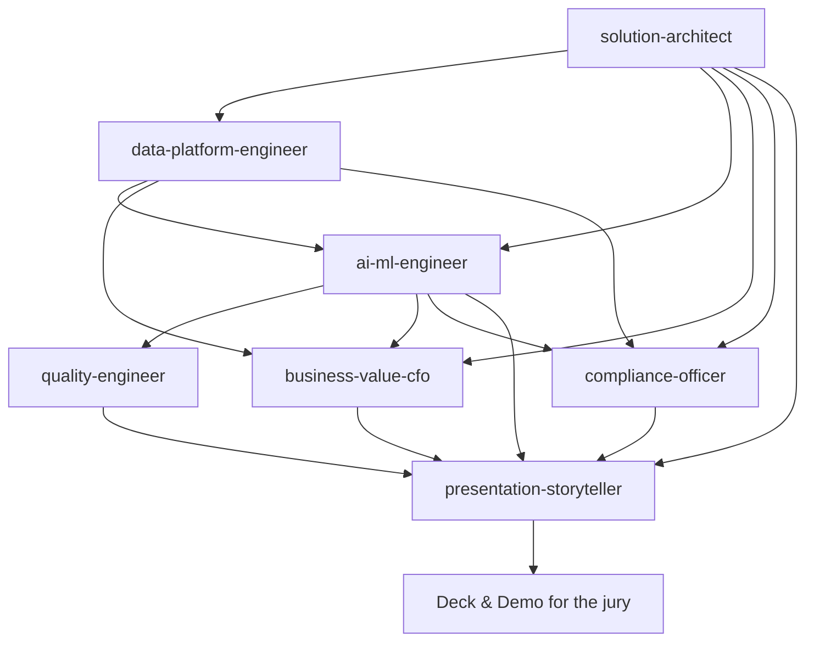

# 09 — GitHub Agents Guide

**Project Ignition** — the custom GitHub Agents that build and maintain this
demo, and how to use them.

> The agents live in [`.github/agents/`](../../.github/agents/). Each is a
> persona with a focused mission, aligned to one or more roles in the target audience.

Role alignment source: [10 — Target audience roles](10-target-audience-roles.md).

---

## 1. The agents

| Agent file | Persona | Owns (in `documentation/work/`) | Jury alignment |
| ---------- | ------- | ------------------------------- | -------------- |
| `solution-architect.md` | Cloud & AI Solution Architect | `02-solution-architecture.md` | COO |
| `data-platform-engineer.md` | Microsoft Fabric & IoT Data Platform | `02a-fabric-iot-architecture.md` | CTO / Head of IT/OT + CDO |
| `ai-ml-engineer.md` | AI/ML Engineer | `03-data-and-ai-design.md` | Head of Data Science / ML Lead |
| `business-value-cfo.md` | Business Value / Finance | `05-cost-estimate.md` | CFO |
| `compliance-officer.md` | Compliance & Responsible AI | `06-security-compliance.md` | Compliance Officer + DPO |
| `quality-engineer.md` | Steel Quality & Process | quality sections of `01`/`03` | Head of Quality |
| `presentation-storyteller.md` | Executive Storyteller | `07-presentation-deck.md`, `08-demo-script.md` | Head of Sustainability / ESG |

## 2. How they fit together

The **architect** sets the technical frame; the **data-platform engineer** builds
the Microsoft Fabric + IoT data plane; the **AI/ML** and **quality** engineers
detail the workloads; **business value** and **compliance** make it investable and
defensible; the **storyteller** assembles the jury-ready deck and demo.

## 3. Using the agents

These are **GitHub Copilot custom agents** defined as Markdown files with YAML
front matter (`name`, `description`, optional `tools`) followed by instructions.

- **Invoke** an agent by selecting it (e.g. `@solution-architect`) in a
  Copilot-enabled surface that supports custom agents, then give it a task such
  as *"update the architecture for a second furnace line"*.
- **Chain** them: run the architect first, then the AI/ML engineer, then the
  business-value and compliance agents, and finally the storyteller to refresh
  the deck.
- Each agent reads `README.md` and the relevant files in `documentation/work/`
  for context and writes back to the document it owns.

## 4. Conventions the agents follow

- Keep all figures **labelled as illustrative demo estimates**.
- Keep personal/operator data **in the EU**; never propose exporting it.
- Keep humans in the loop for any safety, emissions or personnel decision.
- Align numbers across docs (architecture ↔ cost ↔ compliance ↔ deck).

## 5. Extending the set

Add a new agent by creating `.github/agents/<name>.md` with the same front-matter
pattern. Remaining candidate additions: a **FinOps** agent (deep Azure cost
optimization), an **Adoption & Change Management** agent, or an **OT Security**
agent (Defender for IoT / Purdue-model hardening).
